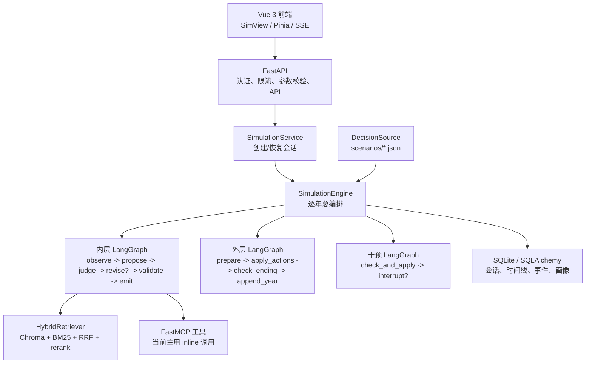
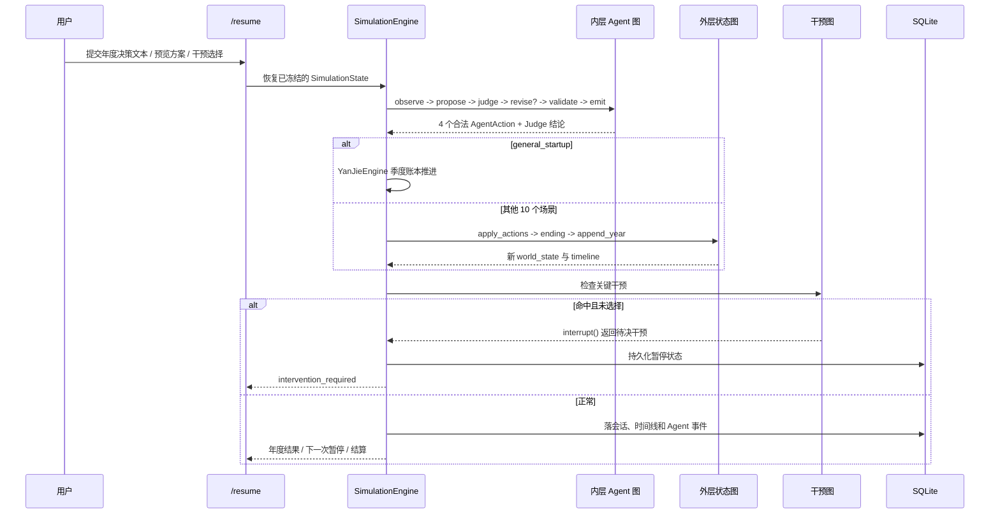
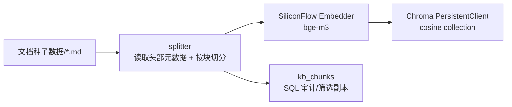

# 衍界 YanJie AI 推演系统技术审查与答辩说明

## 整改验收更新（2026-08-10）

本节覆盖下文审查后完成的“可信演示与稳定交付基线”整改；下文原始风险记录保留，用于说明整改背景，不能再作为当前状态。

已闭环的关键问题：

- `general_startup` 的季度账本现在消费经过白名单校验的四角色 `AgentAction` 共识。防御性、多数增长和明确退出意图分别映射为可审计的账本决策，账本中保留决策依据和角色动作。
- `/ask/stream` 已恢复可消费的 `token` / `done` SSE 契约。根因是请求体限制中间件在回放请求体后伪造 `http.disconnect`，使 SSE 提前取消；修复后仅转交真实断连信号，并有 HTTP 边界回归测试。
- MCP 运行时明确只支持进程内 `inline` 调用。未实现的 `stdio` 配置会立即报错，不再静默生成空工具表；调用结果统一为 `McpToolResult(status, content, error_code)`，未知工具、空结果和执行失败可被 Agent 证据层区分。
- 选择 PostgreSQL checkpointer 而缺少 `langgraph-checkpoint-postgres` 时，启动会明确失败，不会悄悄退回 `MemorySaver`；`iter_events()` 首次暂停后的不可达旧批处理循环已删除。
- 新增 `pytest.mark.live` 受控验收。普通测试默认跳过外部调用；设置 `YANJIE_RUN_LIVE_TESTS=1` 后，已验证真实 embedding、带 `scenario_id` 过滤的混合检索和快模型最小响应，且测试不输出任何密钥或上游原文。

当前可对外准确表述为：**MVP 已具备可信演示基线，核心推演、暂停恢复、SSE 追问、工具失败边界和真实 LLM/RAG 链路均有自动化验证。** 仍不应宣称已完成长期 Agent memory 运行时接线、自动 collection 场景路由或 MCP stdio transport；这些属于下一阶段生产化能力。

最终验收记录：

| 验证项 | 实际结果 |
| --- | --- |
| 本地后端全量回归 | `459 passed, 3 skipped, 41 warnings in 115.21s` |
| 默认 live 验收 | `2 skipped`，未发起外部调用 |
| 显式 live 验收 | `2 passed`，真实 embedding、混合检索与快模型均可用 |
| 前端生产构建 | `npm run build` 成功，退出码 `0` |

当前仅剩一项非阻断构建警告：图表相关产物压缩前约 552 kB，后续可用更细的动态分包优化首屏加载；它不影响本次功能和类型构建结果。

> 审查日期：2026-08-10  
> 审查范围：`app/`、`frontend/src/`、`scenarios/`、`文档种子数据/`、`tests/`、当前运行配置与构建结果  
> 目的：基于真实代码说明系统如何工作，并区分已交付能力、部分接通能力和设计目标，供答辩、面试与后续开发交接使用。

## 0. 先给结论

**项目已经越过了原型期，但不应称为“接近开发末期”。**

更准确的表述是：**MVP 的功能面和工程骨架完成度较高，已进入“核心推演正确性、真实集成、可观测性和交付验证”的收尾前阶段。** 前端可以构建，场景、账户、画像、历史、比较、推演暂停/恢复等业务面也已经存在；但产品最重要的承诺是“可信的决策推演”，这里仍有数项未闭环的正确性与集成风险。

本次实际验证结果：

| 项目 | 结果 | 含义 |
| --- | --- | --- |
| 后端测试收集 | 449 项 | 覆盖面已具规模 |
| 后端测试执行 | 第 88 项失败，`87 passed, 1 failed` | 不能声称回归套件全绿 |
| 失败用例 | `tests/test_ask.py::TestAskStream::test_stream_endpoint_returns_tokens` | `/ask/stream` 返回 HTTP 200，但测试未收到 `token` SSE 事件 |
| 前端生产构建 | `npm run build` 成功 | TypeScript 检查与 Vite 打包可通过 |
| 当前运行配置 | 真实 LLM、RAG、MCP 均启用；checkpointer 为 `memory` | 数据库会话会持久化，但 LangGraph 快照不跨进程保留 |

### 完成度判断

| 维度 | 判断 | 依据 |
| --- | --- | --- |
| 业务功能广度 | 高 | 11 个场景、推演、比较、画像、日记、报告、追问、认证与前端页面均已落代码 |
| 决定性模拟内核 | 中高 | 场景 JSON、状态 reducer、结局、评分、风险与干预均为可测试的纯逻辑 |
| 多 Agent 编排 | 中高 | 双层 StateGraph、四角色并行提案、Judge 修订循环均可运行 |
| RAG 基础设施 | 中 | 入库、Chroma、BM25、RRF、rerank、元数据过滤均已实现；场景分类路由尚未接到主链路 |
| MCP 生产化 | 低到中 | FastMCP 工具和同进程调用可用；宣称的 stdio 子进程传输未实现 |
| 记忆与恢复 | 中 | 业务会话可落 SQLite；长期 Agent memory 只有存储实现，未接到 Agent 推演上下文；默认 checkpoint 不持久化 |
| 真实 LLM/RAG 质量验证 | 低 | 测试主要使用 stub/假 embedder，缺少真实提供商、真实知识库质量与长会话恢复验收 |
| 发布可用性 | 中低 | 当前测试不全绿，且仍有死代码、关键场景的决策耦合与工具错误吞没问题 |

因此，若以“功能做出来了吗”衡量，项目接近完整；若以“可以可信地对外演示和稳定交付了吗”衡量，仍至少需要一个核心整改迭代。

---

## 1. 已实现资产概览

- 后端：约 101 个 Python 模块，FastAPI、LangGraph、LangChain、SQLAlchemy、Chroma 和 MCP 均已落地。
- 场景：`scenarios/` 内有 11 份 JSON 决策源，覆盖创业、考研、留学、职业、求职、买房和投资等。
- 知识：`文档种子数据/` 按领域存放 Markdown；当前工作区已有 `chroma_db/` 持久化目录。
- 数据：SQLite 业务库 `yanjie_dev.db`；LangGraph SQLite checkpoint 目标库 `yanjie_checkpoint.db` 也存在，但当前配置使用内存 checkpointer。
- 前端：Vue 3 + TypeScript + Pinia + ECharts + Three.js，推演页通过 SSE 启动会话、通过 HTTP `/resume` 逐年推进。
- 测试：449 项被 pytest 收集，包含 schema、reducer、Agent stub/LLM 解析、RAG、MCP、LangGraph 结构、暂停恢复、API、安全和端到端场景测试。

项目最可取的架构原则是：**场景事实、动作效果与结局阈值由决策源和确定性代码掌握；LLM 只负责在允许动作范围内给出多视角建议与解释。** 这避免了把“结局”交给模型自由发挥。

---

## 2. 总体架构和真实调用边界



需要准确说明的是：这不是一个把三张图直接串成单一大图的设计。`SimulationEngine` 手工按年度顺序调用三张已编译图：先内层 Agent 图产出动作，再调用外层状态图落地动作和判结局，最后调用干预图检查是否暂停。这个选择使“LLM 编排”和“确定性世界状态推进”能独立测试。

---

## 3. 推演主链路：用户一次操作实际经过什么

### 3.1 建立会话阶段

1. 前端调用 `POST /api/simulations` 或 `POST /api/simulations/stream`。
2. `ScenarioService` 从 `scenarios/<scenario_id>.json` 加载并以 Pydantic `DecisionSource` 校验。场景文件定义输入变量、初始世界状态、角色可选动作、动作 effect、结束条件和干预规则。
3. `make_initial_state()` 校验用户参数。不允许未声明字段；必填、类型、最小/最大值都在此拦截。用户画像会影响初始世界状态，并被复制到 `simulation_sessions.user_profile`，形成不可被后续画像修改篡改的快照。
4. 引擎生成启动前简报，初始化 `SimulationState`，并把场景、初始状态、输入和对话历史写入 SQLite。
5. **当前协议在此主动暂停。** 首个 SSE 流只发出 `simulation.started` 和 `simulation.paused(year_decision_required)`；它不会自动推进第一年。用户必须在前端输入年度决策，再调用 `POST /api/simulations/{session_id}/resume`。

这是一种“先澄清，再推进”的交互式模拟，而不是一次性批处理。答辩时不要说“点击开始后系统会自动模拟 N 年”。

### 3.2 每年推进阶段



年度结束时，系统会将 `TimelineNode`、四个 AgentAction、状态增量、辩论记录、干预记录、评分和风险等落到业务库。前端的恢复能力主要依赖这些业务数据，而不是完全依赖 LangGraph checkpoint。

### 3.3 两套状态推进实现

| 路径 | 范围 | 状态如何变化 | 结论 |
| --- | --- | --- | --- |
| 通用场景 | 除 `general_startup` 外的 10 个场景 | 动作 ID 查 `action_effects`，经 reducer 累加到 `WorldState` | 结构清晰，LLM 只能在允许动作中选择 |
| 通用创业账本 | `general_startup` | `YanJieEngine` 以季度经营账本更新订单、收入、成本、现金和回本 | 数字账本较完整，但当前并未用四 Agent 的动作来选账本决策 |

这个特例是当前最关键的推演风险：`general_startup` 的账本动作由用户文本关键词和粗粒度策略映射 `_startup_decision_id()` 决定；传入的四个 AgentAction 主要被用于补充文字理由和置信度。也就是说，在最复杂的创业场景中，**多 Agent 辩论对量化结局没有实质控制权**。同时 `aggressive` 与 `steady` 映射高度重合，“保守/稳妥/谨慎”等文本并未被完整识别。这与“Agent 参与推演决策”的产品叙事不一致，应在正式答辩前整改或诚实描述为“解释层而非决策层”。

---

## 4. LangGraph 如何编排

### 4.1 外层图：确定性时间线状态机

文件：`app/engine/graph.py`

```text
prepare -> apply_actions -> check_ending -> append_year -> END
```

- `prepare`：清理暂停态、将 phase 置为 `simulating`。
- `apply_actions`：调用 `reducers.apply_actions()`；每个动作必须属于该角色白名单且在场景定义中有 effect，否则直接报错。
- `check_ending`：调用 `ending.judge_ending()`，按场景阈值判断 `bankrupt`、`goal_reached`、`steady` 或 `timeout`。
- `append_year`：把新状态、动作、差分和结局追加进 timeline。

节点不调 LLM，核心 reducer/ending 都是纯函数。这种做法的面试价值是：模型输出可变，但数值规则、边界和终局可复盘、可测试。

### 4.2 内层图：四角色讨论与 Judge 修订

文件：`app/agents/inner_graph.py`

```text
observe -> propose -> judge --通过--> validate -> emit -> END
                         |
                       不通过且未到上限
                         v
                    revise -> propose
```

- `observe`：对四个角色构造 `AgentContext`。它包括当前状态、场景变量、年度策略、启动简报、用户最新决策、用户画像摘要、允许动作白名单、上一轮冲突约束和角色专属证据。
- `propose`：`ThreadPoolExecutor` 并行调用 market、environment、personal、risk 四个 Agent，最后按角色固定顺序收集结果。
- `judge`：Judge 检查动作是否冲突、冲突严重度和修订建议。
- `revise`：把 Judge 结论转成中文反馈与更窄的动作白名单，再回到 `propose`。
- `validate`：二次验证动作是否合法；如果模型产出未声明 action，替换成当前白名单第一个动作；对含内部英文标识或不适合展示的说明使用中文兜底文案。
- `emit`：深复制出本轮 AgentAction。

当前默认最大修订次数是 2。达到上限后，即使 Judge 不完全通过也会进入 `validate`，以避免无限循环。它保证了可用性，但意味着“最终放行”不等于“专家一致同意”，前端应继续展示冲突和保留意见。

### 4.3 人工干预图：HITL 暂停点

文件：`app/engine/intervention_graph.py`

`check_and_apply` 会根据世界状态、年份和已使用规则找到干预节点。若需要用户选择且未提供 choice，它调用 LangGraph `interrupt(pending.model_dump())`，引擎将状态落库并返回 `intervention_required`。用户在 `/resume` 给出 choice 后，图应用该 choice 的 effect 并更新时间线。

这就是项目的 Human-in-the-Loop 实现：用户不是在结果出来后才评论，而是在影响世界状态的关键节点直接选择分支。

### 4.4 Checkpointer 的真实状态

代码支持 `MemorySaver`、`SqliteSaver` 和可选 `PostgresSaver`，图均以 `thread_id` 编译/调用。**但当前运行配置是 `CHECKPOINTER_URL=memory`，所以图级快照只在单个引擎对象生命周期内有效，不跨进程。** 跨请求恢复实际依赖 SQLite 的 `simulation_sessions`、timeline 和 agent_states 重建，而不是原生 `Command(resume=...)` checkpoint 恢复。

此外，PostgreSQL saver 依赖的 `langgraph-checkpoint-postgres` 未在当前 `pyproject.toml` 中声明；若生产环境只改 URL 而不补依赖，代码会静默降级到内存 saver。这是生产化前必须显式处理的风险。

---

## 5. Agent 工作流与提示词工程

### 5.1 四个 Agent 的角色边界

| Agent | 关注面 | 额外证据 |
| --- | --- | --- |
| market | 需求、客群、产品、渠道、竞品 | 场景知识检索 |
| environment | 政策、规则、宏观/外部环境 | 场景知识检索 |
| personal | 时间、能力、团队、执行负荷 | 知识检索 + 执行能力评估工具 |
| risk | 现金缓冲、不可逆投入、下行和止损 | 知识检索 + 压力测试工具 |

角色并不是自由聊天机器人。每个角色收到的 `allowed_action_ids` 来自场景 JSON；模型只能选其中一个。Judge 冲突后还会继续收窄下一轮可选动作。

### 5.2 LLM / Stub 双路径

- Stub 路径：`StubAgent` 基于世界状态、风险偏好和行动描述产生确定性动作，支持离线测试和“断 LLM 仍可判断结局”。
- 真实 LLM 路径：`LlmAgent` 使用 LangChain `ChatOpenAI` 兼容 DeepSeek、Ollama、vLLM、LM Studio 等 OpenAI 风格接口。
- 路由：快模型负责四 Agent 年度建议；慢模型优先用于 Judge。`LLMRouter` 还提供 stub tier。
- 并发：四角色提案并行，Judge 在汇总后串行评审，降低一轮总等待时间。

### 5.3 Prompt 的构造

`LlmAgent` 将 System 与 User 消息分开：

- System：声明角色立场、目标、角色边界、必须只选允许动作、输出字段、中文要求、不能编造资料、不能泄漏内部字段。
- User：注入年度、决策变量、情境简报、只含趋势而不暴露原始数值的状态概况、用户最新决策、画像摘要、动作清单、Judge feedback、约束、RAG 状态和证据。
- 不可信数据：用户输入、画像、最新决策、RAG 与工具返回先经 sanitize，再包进 `[UNTRUSTED_USER_DATA]` 或 `[UNTRUSTED_RETRIEVED_DATA]` 边界标签。

模型应返回 JSON，随后用“直接 JSON -> Markdown 代码块 JSON -> 平衡花括号提取”三层解析，并由 Pydantic/白名单做业务校验。这个“提示约束 + 解析 + 业务校验”比只写 prompt 更可靠。

不过需如实说明：当前代码没有使用 `response_format`、`with_structured_output()` 或 function calling schema；它仍依赖模型服从 JSON 文本协议。项目自身规范要求关键输出优先采用协议层约束，因此这是一个应完成的改进点。另一个配置风险是快模型默认 temperature 为 `0.7`，高于决策推演建议的低温范围（0 到 0.3）。

---

## 6. RAG：从资料到 Agent 上下文的具体流程

### 6.1 离线入库链路



`run_ingest()` 的流程是：加载 Markdown -> `split_documents()` 读取 YAML/Markdown 元数据与标题 -> 生成 chunk ID -> 调 bge-m3 embedding -> `ChromaStore.upsert()` -> `KbChunkRepo.save_batch()` 双写 SQL。元数据包括来源、场景、行业、城市和 chunk 类型，用于后续展示来源与过滤。

注意：入库是显式管道，并不是应用启动时自动扫描所有种子数据。因此部署时需将 ingest 作为独立任务执行，并校验 Chroma collection 数量和 SQL 双写一致性。

### 6.2 在线混合检索链路

```text
Agent 问题
  -> 生成带场景、变量、年度和用户决策的 query
  -> 向量检索 top-N（bge-m3 / Chroma）
  -> BM25 关键词检索 top-N（中文按字切分兼容）
  -> RRF 融合候选
  -> SiliconFlow reranker 重排
  -> 截取 top-K、保留 source 元数据
  -> 清洗并标记为不可信资料
  -> 写入 AgentContext.rag_context / evidence
```

`HybridRetriever` 在 embedding 服务不可用时仍可走 BM25 兜底；reranker 失败时也会保留融合结果。角色工具路由只取少量结果，单个证据摘要被截断，避免将完整知识库塞进 prompt。

### 6.3 场景路由的现状

`classify_scene.py` 已实现关键词优先、LLM 二次分类及“领域 -> collection 名称”的映射；`RoleToolRouter` 的实际主链路目前使用 `where={"scenario_id": state.scenario_id}` 过滤。**分类函数未被主推演调用。** 因而“按行业独立 collection 的自动场景路由”目前是已具备模块而未完成接线的能力。

答辩时建议说：

> 当前上线链路采用场景 ID 元数据过滤，保证不串场；我们已经把 collection 路由抽象成独立函数，下一步会将它接到检索器工厂，用于多领域知识规模扩大后的隔离与性能优化。

---

## 7. MCP：工具模式和实际调用方式

### 7.1 已注册的工具

`app/mcp_server/server.py` 使用 `FastMCP` 注册四个工具：

| 工具 | 用途 | 实际后端 |
| --- | --- | --- |
| `search_knowledge` | 场景相关知识证据 | HybridRetriever |
| `search_web` | 新鲜公开市场信息 | Tavily，未配置 key 时降级 |
| `assess_execution_capacity` | 时间、资源和执行约束 | 本地确定性函数 |
| `run_risk_stress_test` | 下行风险和停止条件 | 本地确定性函数 |

工具不是让模型随意自选。目前由 `RoleToolRouter` 按角色白名单主动编排：每个角色都有知识检索，personal 加执行能力评估，risk 加压力测试。工具输出会变成带名称、状态和来源的 `AgentEvidence`，再进入 AgentContext，利于审计和前端展示。

### 7.2 当前实际模式：inline

真实 LLM 模式下，`SimulationEngine` 构造 `McpToolClient(mode="inline")`。该 client 直接 import `app.mcp_server.tools` 中的 Python 函数执行，**没有通过 MCP 协议进行网络或子进程往返**。FastMCP server 的注册存在，因此工具定义可以被外部 MCP host 使用；但应用自身主链路是“同进程函数调用”。

这样做的优点是零进程开销、测试稳定；缺点是无法验证真正的 MCP transport、权限隔离和进程故障边界。

### 7.3 stdio 模式并未完成

`McpToolClient` 的注释声称支持 `mode="stdio"` 启动子进程并使用 JSON-RPC，但该分支没有 spawn server、握手、`list_tools`、请求 ID、stdin/stdout 读写或超时实现。非 inline 模式下工具表为空，调用会落到 unknown tool。故“inline/stdio 双模式已可生产切换”不是事实。

还应注意错误语义：工具调用失败多数返回空字符串或“暂不可用”文字，调用者有时不能严格区分“无搜索结果”和“工具故障”。这会让 Agent 在缺少证据时仍继续推演，应改为结构化 `ToolResult(status, data, error_code)` 并在日志中记录失败原因。

---

## 8. 记忆持久化、会话恢复与上下文管理

### 8.1 真正接入运行时的三层状态

| 层级 | 保存内容 | 存储 | 当前是否进入主链路 |
| --- | --- | --- | --- |
| 短期图状态 | 单次图调用的 checkpoint | 默认 MemorySaver，可选 SQLite/Postgres | 是，但当前配置不跨进程 |
| 会话状态 | 输入、世界状态、timeline、干预、约束、决策历史、画像快照 | SQLite `simulation_sessions` 等表 | 是，跨 HTTP `/resume` 恢复的主力 |
| 长期 Agent memory | `(user_id, agent_id, domain, key) -> value` 或向量记忆 | `agent_memories` / Chroma `AgentMemoryStore` | **否，仅有 repository/store 与单测，未被 AgentCoordinator 读写** |

业务会话恢复具体做法是：`SimulationService.restore_state()` 从 `simulation_sessions` 重建 Pydantic `SimulationState`，恢复 timeline、冻结画像、创业账本、待干预节点、决策预览和上轮 Agent 约束。它保证用户刷新/返回后仍能继续该次推演。

`agent_memories` 表和 `AgentMemoryStore` 的设计方向正确：SQL 适合结构化键值，Chroma 适合按用户 ID 过滤的语义召回；但当前没有在 `observe()` 前 retrieve，也没有在年度结束后 save。因此不能在面试中说“Agent 会记住用户跨会话偏好”，只能说“长期记忆基础设施与隔离测试已完成，运行时接线尚未完成”。

### 8.2 上下文控制措施

- 用户画像先被压缩为 `build_profile_summary()` 的可读摘要，避免把整条画像直接塞入 prompt。
- 最后一条有效用户输入作为年度决策，进入四个角色的共同上下文；消费后清空临时 `user_message`，防止无意跨年泄漏。
- RAG 证据按角色分配并截断，包含 status 和 source；内容先清洗再标为不可信。
- Judge 冲突被转换为短反馈和动作白名单约束，而不是将每轮完整对话无限累积。
- 业务库保存初始 conversation history 与结构化 timeline，追问服务按 session 和可选 year 从数据库重建上下文。

仍需补齐的控制是明确 token budget、每类上下文的长度指标、证据过期策略和长期记忆召回/写入策略。

---

## 9. 评分、风险、结局和可解释性

- 结局：`judge_ending()` 是阈值比较，不由 LLM 生成；场景可以定义破产、目标达成、稳态和超时条件，用户成功标准可覆盖部分默认阈值。
- 状态效果：每一个 AgentAction 都必须在 DecisionSource 中声明 effect，`reducers.apply_actions()` 统一累计到标准世界状态。
- 评分：`compute_score()` 依据世界状态、场景、用户目标和结局计算总分与明细。
- 风险：`extract_risks()` 对创业、教育、留学、职业、求职、购房、投资分别生成可读风险；`build_action_plan()` 把风险映射为带数量/期限的行动建议。
- 风险图：`risk_graph.py` 从状态和风险生成 DAG，前端可请求 `/risk-graph` 可视化风险传导。
- 辩论：`build_debate()` 保留四角色的支持/反对立场、理由、异议和 Judge 总结，让“模型为什么这么建议”能够回看。

这组设计是答辩最适合强调的可信性路径：**生成建议可以有不确定性，但约束、作用、结果、评分和留痕可验证。**

---

## 10. 整改前审查基线：关键发现与原始优先级

### P0：答辩或发布前应修复

1. `tests/test_ask.py:182` 的 SSE token 测试失败。端点返回 200 却没有测试可消费的 token，流式追问的对外契约不可靠。
2. `general_startup` 的量化账本不消费四 Agent 的动作；它会削弱项目核心“多 Agent 推演”叙事，也可能让解释与数字结局不一致。
3. `general_startup` 的策略/文本意图映射过粗，`aggressive` 与 `steady` 不能形成可辨识分支，保守表达覆盖不足。

### P1：下一个迭代应处理

1. 删除或重构 `SimulationEngine.iter_events()` 中首个暂停后的不可达旧批处理循环，避免维护者误判实际协议；相应的 `PAUSE_EACH_YEAR` 逻辑目前也处在这段死代码中。
2. 实现真实 MCP stdio client，或删除“已支持 stdio”的声明；为工具返回定义结构化成功/无结果/失败状态。
3. 以 `response_format`、function calling 或 `with_structured_output` 替换手工 JSON 文本解析作为主约束，保留解析兜底。
4. 默认将快模型温度调整到 0 到 0.3，给随机性使用显式的 variation seed，而不是依赖高 temperature。
5. 把 `classify_scene` 接入检索器工厂；通过实际 collection 分域或保持统一 collection + 强 metadata 索引，二者择一并做基准测试。
6. 接通长期 Agent memory 的 retrieve/save，并设置用户隔离、过期、删除与人工可见性策略。
7. 生产配置补齐 PostgreSQL checkpointer 依赖和迁移方案，避免静默回退到 MemorySaver。

### P2：质量和运维增强

1. 统一异常处理：日志中保留根因，API/Agent 获得结构化安全兜底，禁止以空字符串作为通用失败信号。
2. 为真实 LLM、Embedding、rerank、Tavily 和 MCP transport 增加契约/沙箱集成测试；当前绝大多数测试使用 stub 或 mock。
3. 给慢集成测试加 pytest marker，单独报告单测与集成测试结果。
4. 为 RAG 增加命中率、来源覆盖、过期率和幻觉审查样本；为推演增加场景校准样本和策略差异快照测试。

---

## 11. 可直接用于答辩的 90 秒表述

> 衍界不是让大模型直接替用户算命，而是一个“决策源驱动”的推演工作台。首先，场景 JSON 定义输入变量、世界状态、角色可以采取的动作、每个动作的确定性影响和结局阈值。这样数值状态、风险、评分和结局由纯函数推进，LLM 不拥有决定结局的权限。
>
> 在每个年度，系统先运行内层 LangGraph：市场、环境、个人、风险四个角色并行读取同一份场景状态，但拿到不同的 RAG/MCP 证据；它们只能从白名单动作中选一个。Judge 检测冲突，并把反馈和更窄的动作约束回灌给下一次提案。之后外层 LangGraph 将通过校验的动作应用到世界状态、判定是否结束并写入时间线。关键风险节点由 LangGraph interrupt 暂停，用户可以选择分支后从业务会话恢复。
>
> 知识库侧使用 bge-m3 向量检索和 BM25 关键词检索，经过 RRF 融合和 rerank，资料带来源和场景元数据，并作为不可信外部数据清洗后提供给 Agent。所有会话状态、时间线和画像快照落在 SQLite，保证推演可复盘。当前已经完成 MVP 的主体能力，下一步重点是把长期 Agent memory、真实 MCP stdio transport 和真实模型评测接成可生产验证的闭环。

---

## 12. 常见追问与回答边界

| 面试官问题 | 推荐回答 |
| --- | --- |
| 为什么不用一个大 prompt 一次性生成结局？ | 重大决策要可复盘。我们把事实、动作效果和阈值留在决策源/纯函数，把 LLM 限制为建议和解释层，降低幻觉对结局的影响。 |
| LangGraph 的价值是什么？ | 它把 Agent 协调、世界状态推进和人工干预拆成独立有状态图，支持条件循环、interrupt 和 checkpoint；核心业务函数仍可脱离 LLM 单测。 |
| RAG 如何避免串场？ | 当前主链路按 `scenario_id` metadata 过滤，结果保留 source；场景分类/collection 路由已抽象但尚未接入主推演。 |
| MCP 是模型自由调用工具吗？ | 当前不是。系统通过角色白名单主动编排工具，避免模型越权和无关调用；应用内使用 inline 函数调用，真正 stdio transport 是下一步。 |
| 记忆如何做？ | 会话记忆已通过 SQLite 状态与 timeline 恢复；长期 Agent memory 有 SQL/向量存储基础设施，但未接到运行时，因此不会夸大成跨会话智能记忆。 |
| 当前最大风险是什么？ | 推演可信性而非页面数量：创业账本与多 Agent 动作尚未统一、SSE 追问测试未绿、真实外部服务链路没有完整验收。 |

---

## 13. 证据索引

- 推演总编排：`app/engine/engine.py`
- 外层图、干预图：`app/engine/graph.py`、`app/engine/intervention_graph.py`
- 内层 Agent 图和角色工具路由：`app/agents/inner_graph.py`、`app/agents/tool_router.py`
- LLM 与 Judge：`app/agents/llm_agent.py`、`app/agents/judge.py`、`app/core/llm.py`
- RAG：`app/kb/ingest.py`、`app/kb/retriever.py`、`app/kb/chroma_store.py`、`app/kb/classify_scene.py`
- MCP：`app/mcp_server/server.py`、`app/mcp_server/client.py`、`app/mcp_server/tools.py`
- 持久化：`app/db/models.py`、`app/db/repository.py`、`app/services/simulation_service.py`
- 测试：`tests/test_langgraph_structure.py`、`tests/test_checkpoint.py`、`tests/test_mcp.py`、`tests/test_kb.py`、`tests/test_ask.py`

本说明只陈述本次检查到的实现。产品 PRD 中“PostgreSQL + pgvector + Redis”“MCP stdio”“长期 Agent memory”“场景 collection 自动路由”等目标，不应被表述为当前已完整交付能力。
