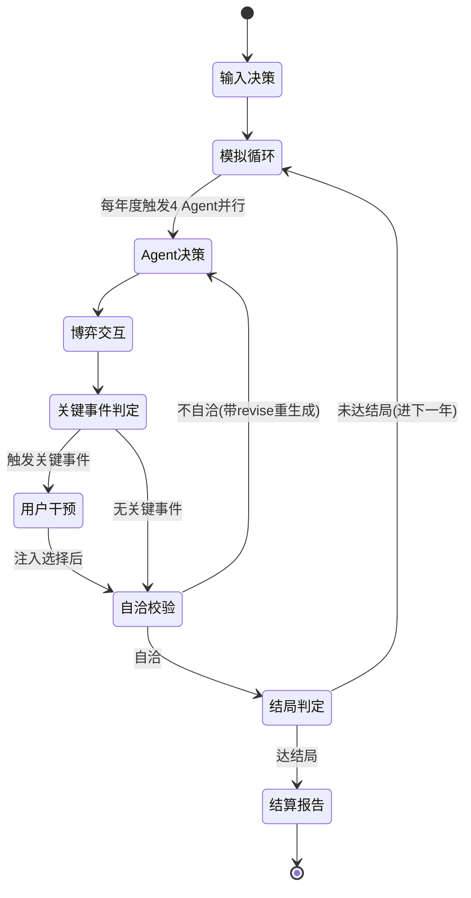
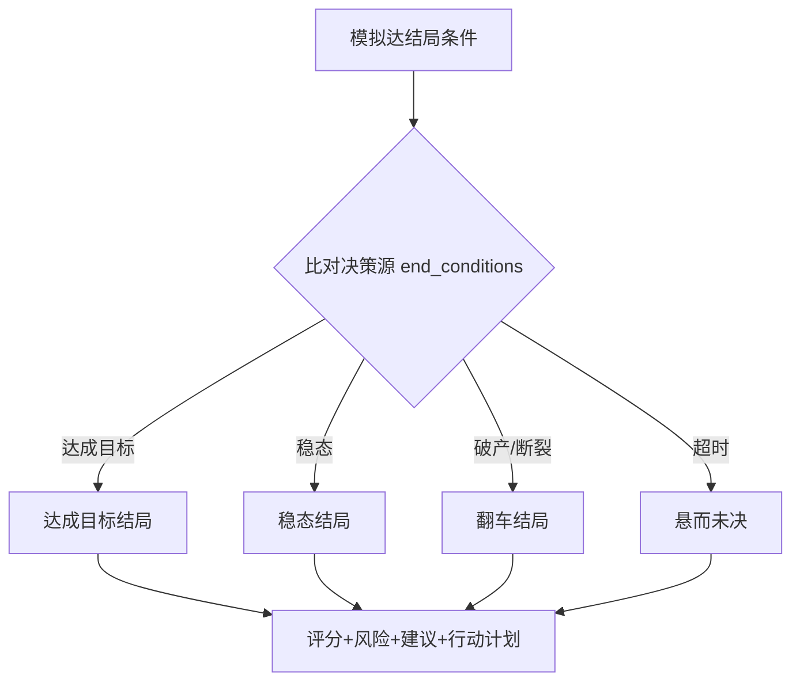
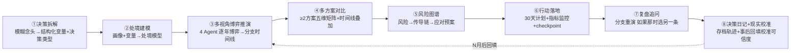
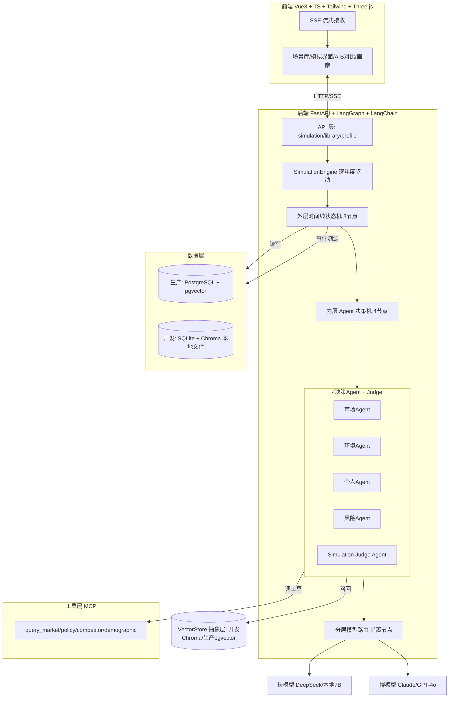
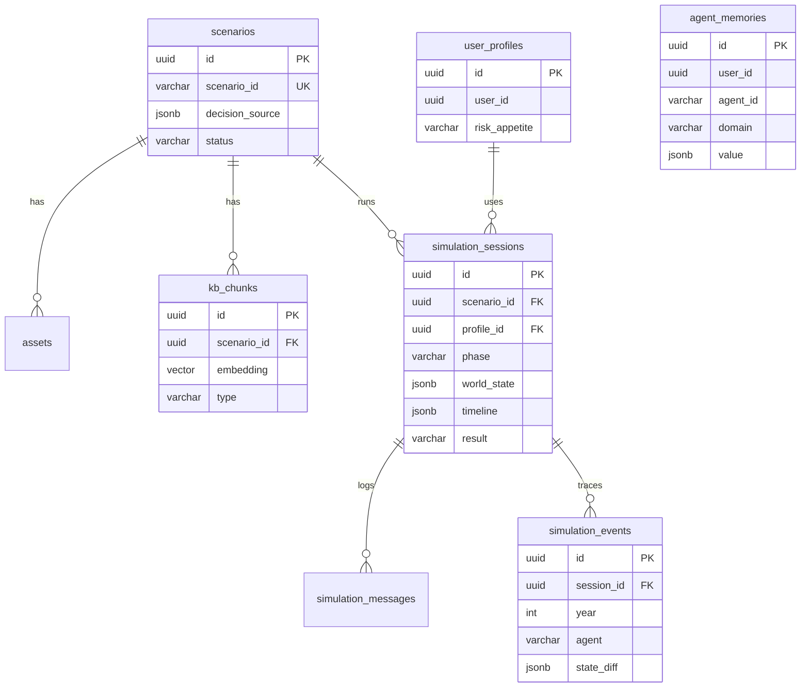

# 衍界 YanJie AI · 产品需求文档（PRD）

> 版本 最终优化版（v1.4）｜ 2026-07-28 ｜ 作者：浩哥 × 高级开发工程师 ｜ 状态：定稿
> 定位：**AI 决策推演工作台（Decision Simulation Workbench）**——不是单点"模拟器"，而是覆盖「拆解→建模→推演→对比→风险→行动→复盘→校准」全周期的决策辅助系统。把"我该不该 X"的模糊纠结，变成结构化推演 + 多视角博弈 + 风险图谱 + 行动落地 + 长期校准。
> 说明：本文档为**个人学习者项目（面试作品集向）** PRD，已按企业级模板裁剪——保留可执行骨架，剔除灰度发布/权限矩阵/埋点看板/商业 KPI 等企业专属内容。技术内核（两层 LangGraph / 多 agent / 决策知识库 / MCP / 分层路由 / 记忆 checkpointer / Simulation Judge Agent / 矛盾检测）为前期已验证的多智能体内核，本产品在外壳上由"互动娱乐原型"重定位为"AI 决策推演工作台"，内核一行不改。**v1.4** 相对 v1.3 补充三项借鉴优化（参考本地 deep-agent / multi_scene_rag 代码）：① 6.5 决策知识库场景化路由 ② 4.7 关键节点干预改用 LangGraph `interrupt()` 标准 HITL ③ 6.4.1 Agent 记忆分层（长期记忆 store 与 checkpointer 分离）。v1.3 相对 v1.2 仅补充数据库/向量库双阶段选型与抽象层设计（见 6.5.1 / 6.8 / 7.3 / 7.4），产品功能与架构其余部分不变。；**v1.5** 新增 §6.10 UI 设计系统与组件规范（设计 Token / 信息架构 / 组件清单 / 关键页面线框 / 交互状态 / 响应式 / 数据可视化），供 UI 设计 AI 据此产出饱满、一致的组件图与页面图。

---

## 1. 文档信息

| 项 | 内容 |
|---|---|
| 文档版本 | 最终优化版（v1.5） |
| 编写日期 | 2026-07-28 |
| 编写人 | 姜浩 |
| 文档状态 | 定稿 |
| 基线 | 前期已验证的多智能体内核（两层图 + 多 agent + 决策知识库 + MCP + Simulation Judge Agent） |


**变更日志**
| 版本 | 变更 |
|---|---|
| v1.0 | 首次定稿：产品由"互动娱乐原型"重定位为"人生决策推演沙盘"；技术内核沿用已验证设计；外壳从娱乐产品转决策辅助工具 |
| v1.1 | 按面试官视角锐评优化：①重定位为"AI 决策模拟器"，核心价值从"给答案"转"模拟后果/风险认知" ②场景收缩首阶段聚焦创业模拟器 ③新增 A/B 方案对比、关键节点干预、行动计划(Next Action)、个人画像系统 ④DeepAgent→Simulation Judge Agent 改名 ⑤RAG 章节包装为"决策知识库 Decision Knowledge Base" ⑥DB 新增 simulation_events 事件溯源表 + user_profiles 表 ⑦新增第 12 章商业化方向、第 13 章面试包装与 10 追问 ⑧补强 Agent 数量决策说辞 |
| v1.2 | 产品身份升维：单点"模拟器"→ **"AI 决策推演工作台"**（覆盖决策全周期）。①2.1 核心价值改写为 8 环节闭环（拆解→建模→推演→对比→风险图谱→行动→复盘→现实校准）②3.1 新增 7 功能：决策拆解助手/决策模板库/多方案矩阵对比/风险传导图谱/行动监控checkpoint/决策日记/现实校准 ③5.1 核心循环重画为 8 环节 mermaid + 长期闭环（现实校准回填→重推）④解决"为何长期用"（决策日记轨迹）+"为何相信"（现实校准闭环）两个核心信任问题 |
| 最终优化版 v1.3 | 数据库/向量库选型定稿：①6.1 技术栈数据层改为双阶段（开发 SQLite+Chroma 零部署 / 生产 PostgreSQL+pgvector+Redis）②6.1.1 选型表增 Chroma 行、PostgreSQL/pgvector 标注生产、新增向量库双阶段说明 ③新增 6.5.1 VectorStore 抽象层设计（接口+工厂+切换四铁律）④6.8 部署加"开发零部署"与"开发→生产迁移"小节 ⑤6.9 分包 db/vector.py→vector_store.py 抽象层 ⑥7.3 数据库设计加双阶段说明、DDL 标注生产目标 ⑦7.4 向量库章节重写为双阶段选型 |
| 最终优化版 v1.4 | 借鉴优化（参考本地 deep-agent 与 multi_scene_rag）：① 6.5 决策知识库加「场景化路由」——按创业/职业/买房/投资领域分片独立 collection + `classify_scene` 关键词+LLM 双级路由，长尾不串味 ② 4.7 关键节点干预改述为 LangGraph 标准 `interrupt()` HITL（替代自定义交互，断点续推+可重入+与 AC7 兼容）③ 6.4.1 Agent 记忆分层：补 LongTermStore（跨模拟长期记忆）与 checkpointer（回合状态恢复）分离设计 |
| 最终优化版 v1.5 | 新增 §6.10 UI 设计系统与组件规范（供 UI 设计 AI 参考）：① 设计原则与视觉基调（Premium 数据决策控制台·暗色优先）② 设计 Token（颜色/字体/间距/圆角/阴影/动效/暗亮双色板）③ 信息架构页面树 ④ 组件库清单（基础/业务/数据可视化三类 + 状态）⑤ 关键页面线框级布局（场景库/模拟主界面/结算/A-B对比/风险图谱）⑥ 交互状态规范（流式/加载/错误/干预模态/主题切换）⑦ 响应式断点 ⑧ 数据可视化规范（分支时间线/雷达/对比曲线/风险传导DAG） |

---

## 2. 项目概述

### 2.1 背景与痛点
- **时代背景**：人人遇重大人生决策（辞职创业 / 转行 / 买房 / 投资）都焦虑，现有工具是**静态测算器**（创业测算器 / 买房计算器 / 投资回报计算），只算数字不算"不同立场如何博弈、未来如何分支"；普通 RAG 问答只给一段话答案，不讲过程、不给风险路径；且都是**一次性工具**，用完即弃，无长期决策轨迹、无事后校准。**多智能体决策推演工作台**（全周期 + 长期校准）是市场空白。
- **核心价值主张（v1.2 重定位）**：本产品不是单点"模拟器"，而是**决策推演工作台**——把"我该不该 X"的模糊纠结，拆成 8 环节闭环：
  > ①**决策拆解**（模糊念头→结构化变量+决策类型识别）→ ②**处境建模**（画像+变量→你的处境模型）→ ③**多视角博弈推演**（4 Agent 逐年博弈生成分支时间线）→ ④**多方案对比**（≥2 方案五维矩阵）→ ⑤**风险图谱**（风险→传导链→应对预案）→ ⑥**行动落地**（30天计划+指标监控+checkpoint）→ ⑦**复盘追问**（分支重演"如果那时选另一条"）→ ⑧**决策日记+现实校准**（存档轨迹+事后回填实际结果校准可信度）。

  **三个"单点模拟器"做不到的价值**：①不只推演未来，还帮把模糊念头拆成可推演的结构；②不只给风险清单，给风险传导链+应对预案；③不只一次性，有决策日记长期跟踪 + 现实校准让推演越用越准——解决"为何长期用"（日记轨迹）+"为何相信"（校准闭环）两个核心信任问题。
- **学习痛点**：LangChain / LangGraph / RAG / DeepAgent(以 Simulation Judge Agent 形态落地) / MCP 五样技术散装难成体系。前期内核已把编排练透，但外壳偏娱乐、面试"实用"叙事弱。
- **个人可控**：纯 PGC 场景 + 按量云 API + Mock 数据兜底，个人项目跑得动、烧得起。
- **不做的后果**：技术学习停留在玩具 demo；"多视角博弈推演工作台"这个 AI Simulation 形态的市场空白继续空着。

### 2.2 项目目标（SMART，裁剪为学习+工具目标，不设商业 KPI）
【产品决策】本项目为个人学习者项目（面试作品集向），目标围绕"技术练透 + 工具实用"，不设 GMV/DAU 等商业指标。

| 类型 | 目标 | 量化 |
|---|---|---|
| 业务/学习目标 | 五样技术在真实产品中串成体系 | 引擎完整覆盖 LangChain/LangGraph/RAG/MCP/Simulation Judge Agent 五类调用点 |
| 用户/工具目标 | 单次模拟完整可用、不崩 | 单次模拟 8–12min 跑通"输入决策 → Agent 博弈 → 分支时间线 → A/B 对比 → 风险点 → 行动计划" |
| 技术目标 | 延迟与成本可控 | 首字 < 2s、单次模拟整体 < 3–5min；单次 LLM 成本 < 1 元 |

### 2.3 目标用户画像 + User Story
**画像**
- 有重大决策焦虑的成年人：考虑辞职创业 / 转行 / 买房，想"模拟一下不同选择各自会怎样"。
- 决策犹豫者：反复纠结 A 还是 B，需要一个外部视角把两条路的风险都摆出来。
- AI 工具尝鲜者：愿意试试 AI 帮模拟未来路径（但不盲信 AI 给的"答案"）。

**User Story**
| 作为 | 我希望 | 以便于 |
|---|---|---|
| 想辞职创业的人 | 输入计划，AI 多视角模拟未来走向与风险节点 | 看清这条路到底值不值、会在哪里翻车 |
| 决策犹豫者 | 把 A/B 两个方案并排对比（资产/风险/成长/压力） | 不再靠直觉拍板 |
| 重度用户 | 在模拟中途遇到关键事件时自己选 A/B/C 干预走向 | 体验"如果我那时这么选会怎样" |
| 想行动的人 | 拿到一份可执行的 30 天行动计划（而非"建议提升营销"虚话） | 真正迈出下一步 |
| 学习者（我本人） | 在工具里用上 5 样 AI 技术 | 把散装知识练成体系 + 面试有东西讲 |

### 2.4 成功指标
- **北极星指标**：单次模拟完成率（输入决策 → 触发报告/行动计划导出的模拟占比）。
- **辅助指标**：A/B 对比使用率、关键节点干预参与率、分支结局多样性（同输入不同参数/干预能触发 ≥3 种走向）、引擎里程碑达成（MVP-0/1/2）。
- 【已定】指标采集：**后端日志 + 统计脚本**（从 `simulation_sessions.result` / `simulation_events` 聚合），不上第三方埋点。

### 2.5 技术学习目标
LangChain（粘合+文档管线）· LangGraph（两层状态机/多 agent 编排）· RAG（决策知识库/检索约束）· DeepAgent（以 **Simulation Judge Agent** 形态落地：推演自洽校验/结局判定）· MCP（真实数据查询工具接入）。五样技术调用点与前期已验证内核一一对应，关系见 2.6。

### 2.6 内核设计要点（换壳不换核）
【产品决策】外壳换了，内核一行不改——这是"换壳不换核"的落地。下列能力沿用前期已验证的多智能体内核，调用点 / 数据流 / 边界定义保留，仅替换"领域语义"。

| 通用内核（已验证） | 本产品（工具外壳） | 迁移性质 |
|---|---|---|
| 真相源（剧本事实：角色/秘密/线索/真凶/胜负） | 决策源（场景事实：行业基准/约束/变量/结局判定规则） | 结构同构，内容替换 |
| 两层 LangGraph：外层 7 节点流程 + 内层角色决策 | 两层 LangGraph：外层时间线状态机 + 内层 Agent 决策机 | 架构同构，节点语义替换 |
| 多 agent 编排：主持 + N 个角色 | 多 agent 编排：4 个决策 Agent（市场/环境/个人/风险）+ Simulation Judge Agent | 编排同构，角色替换 |
| RAG 事实一致性四步保障（剧本语料） | 决策知识库一致性四步保障（行业报告/政策/案例语料） | 管道同构，语料源替换 |
| MCP 调查工具（记录/天气/不在场/时间线，Mock） | MCP 真实数据查询工具（query_market/query_policy/query_competitor/query_demographic，Mock+少量真 API） | 范式同构，工具集替换 |
| 分层模型路由（快模型对话/慢模型复盘） | 分层模型路由（快模型模拟/慢模型可行性裁决） | 机制同构，用途替换 |
| 记忆 checkpointer（对局存档续玩） | 模拟 checkpointer（模拟存档续推） | 机制同构 |
| 矛盾检测（证词冲突高亮） | 矛盾检测（模拟逻辑冲突标记） | 机制同构，判定对象替换 |
| DeepAgent 叙事修复 | Simulation Judge Agent 自洽校验 + 结局判定 | 机制同构，校验对象替换 |

---

## 3. 需求范围

### 3.1 功能清单
**用户端**
| 模块 | 功能点 | 优先级 | 备注 |
|---|---|---|---|
| 场景库 | 选场景（卡片+详情：封面/简介/适用人群/所需输入；详情展开决策变量说明） | P0 | 首阶段仅创业场景 |
| 个人画像 | 输入 User Profile（年龄/技能/资产/家庭/风险偏好/职业经历）→ 持久化 | P1 | 让个人 Agent 决策更合理 |
| 单次模拟主循环 | 输入决策 → Agent 博弈 → 分支时间线 → 可行性评分 → 风险点 → 行动计划 | P0 | 核心 |
| 分支时间线 | 年度推进的可视化时间轴，每节点可追溯各 Agent 行动 | P0 | |
| 可行性评分面板 | 多维度评分（市场/资源/政策/风险）+ 综合分 | P0 | |
| 风险点清单 | 模拟识别的关键风险 + 触发条件 | P0 | |
| **A/B 方案对比** | 并排对比两个方案（资产/风险/成长/压力多维表+时间线叠加） | P0 | v1.1 新增·价值核心 |
| **关键节点干预** | 模拟中途遇关键事件弹选择 A/B/C，用户选后改变走向（游戏化） | P0 | v1.1 新增·参与感核心 |
| **行动计划（Next Action）** | 慢模型生成可执行 30 天清单（调研N家竞品/做成本模型/询N个供应商/验证N个用户） | P1 | v1.1 新增·实用闭环 |
| 行动建议 | 下一步建议（避坑要点/资源准备/关键指标监控） | P1 | |
| 推演报告导出 | 时间线+评分+风险+建议+行动计划 → Markdown/PDF 导出 | P1 | |
| 参数调节重推 | 改预算/城市/行业/时间跨度等参数即时重推，看不同结局 | P0 | 面试炸场点 |
| 深度追问 | 模拟后对某 Agent 某年决策追问"为什么" | P1 | |
| Simulation Judge Agent 自洽校验 | 回合末校验模拟逻辑自洽，不自洽回退重生成 | P1 | |
| 真实数据查询（MCP） | Agent 自主调 MCP 查真实市场/政策/竞品/人口数据 | P2 | MCP（Mock+少量真 API） |
| **决策拆解助手** | 模糊念头（"我想辞职开奶茶店"）→ LLM 拆成结构化决策变量 + 识别决策类型（风险型/机会型/止损型） | P1 | v1.2 新增·环节① |
| **决策模板库** | 创业/跳槽/买房/投资等模板填空即用，免用户从零填变量 | P1 | v1.2 新增·降低门槛 |
| **多方案矩阵对比** | A/B 扩展到 ≥2 方案并排五维矩阵（资产/风险/成长/压力/结局）+ 时间线叠加 | P1 | v1.2 升级·环节④ |
| **风险传导图谱** | 风险清单升级：每个风险→传导链（A导致B导致C）→应对预案 | P1 | v1.2 新增·环节⑤ |
| **行动监控 checkpoint** | 30天计划 + 每周提醒 + 关键指标监控阈值告警 | P2 | v1.2 新增·环节⑥ |
| **决策日记** | 所有推演存档成个人决策轨迹（时间线/标签/结局对比），可回看 | P2 | v1.2 新增·长期价值 |
| **现实校准** | 推演 N 月后回填实际结果，系统比对推演 vs 现实，校准推演可信度 | P2 | v1.2 新增·信任闭环 |
| **年度策略指令** | 每年初用户给个人 Agent 下策略倾向（激进扩张/稳扎稳打/保守求存），影响该年决策 | P0 | v1.2 新增·全程参与核心 |
| **成功定义个性化** | 用户自己定"怎样算成功"（回本/月利润X万/学经验/活下来），结局按用户标准判 | P1 | v1.2 新增·个人化目标 |
| **预测下一年** | 每年末用户猜"下一年最可能发生啥"，系统次年反馈猜中与否，逼用户思考 | P1 | v1.2 新增·推演参与 |
| **行动打卡承诺** | 30天计划勾选"我会做哪些"+每周打卡执行情况，缺勤提醒 | P2 | v1.2 新增·行动参与 |

**作者侧（开发期工具）**
| 模块 | 功能点 | 优先级 | 备注 |
|---|---|---|---|
| 场景导入 | 上传行业报告/政策/案例 → LLM 抽取决策源+决策知识库语料 → 校对 → 存库 | P1 | MVP-0 用手写决策源 |

### 3.2 版本规划（MVP → 完整版路线图）
【产品决策·v1.1】**场景收缩**：首阶段聚焦"创业模拟器"，不贪多领域。先跑通 1 个创业场景（奶茶店），验证决策源模板与引擎后，再按同模板扩到其他创业品类（餐饮/零售/服务），最后才考虑跨领域（职业规划/买房）。

| 阶段 | 内容 | 验证目标 |
|---|---|---|
| MVP-0 | 单场景（奶茶店创业）+ 4 Agent + Mock 决策源 + 两层图 + Judge Agent 只判结局 + 纯文本时间线 + 参数重推 | 1–2 天跑通"输入决策 → 不同参数出不同走向" |
| MVP-1 | 接 LLM 润色模拟 + 决策知识库召回约束 + Judge Agent 回合自洽校验 + **关键节点干预** + **A/B 方案对比** | 验证"解耦架构"防胡编 + 交互闭环 |
| MVP-2 | 分支时间线可视化前端 + 行业数据语料入库 + MCP 查真实数据（少量真 API）+ **个人画像** + **行动计划** | 视觉闭环 + 数据真实度提升 + 实用闭环 |
| V2 | 推演报告导出、深度追问、扩到更多创业品类（餐饮/零售/服务）、用户账号存档续推 | 完整体验 |
| V3 | 跨领域场景（职业规划/买房）——**待 V2 验证创业闭环成立后再启** | 跨领域验证 |

每步能跑能 demo，不 all-in。

**难度控制原则（A 导向 · 个人学习者项目）**
- 先文字后视觉：MVP-0/1 纯文本时间线，Three.js 可视化放 MVP-2。
- 场景分批：MVP 只跑 1 个创业场景，验证决策源模板后扩。
- 硬特性后置：Judge Agent 自洽校验 P1、报告导出 P1、MCP 真数据 P2、个人画像 P1、行动计划 P1。
- 面试优先：MVP-0 用 Mock 数据先跑通模拟逻辑与架构，真数据后面补——面试看架构与模拟逻辑非数据精度。

**场景内容策略**：首阶段=创业模拟器，首场景=奶茶店创业；后续按同模板批量产出创业品类，跨领域（职业/买房）放 V3。

### 3.3 明确排除范围（Out of Scope）
- 不做开放 UGC 场景编辑（审核/质量无底洞）。
- 不做精准市场预测/不告诉用户"该不该做"（定位"模拟后果/风险认知"非"给答案"，强免责）。
- 不做实时多人协作模拟。
- 不做跨领域大而全（V3 前只做创业）。
- 【产品决策】不做灰度发布、多角色权限矩阵、第三方数据看板、商业 KPI 追踪——个人学习者项目无对应场景。

---

## 4. 功能详述（核心）

> 对 P0/P1 功能逐模块给出：用户场景 / 前置条件 / 主流程 / 分支流程 / 异常处理 / 业务规则 / 界面要求 / 数据需求。

### 4.1 场景库选择（P0）
- **用户场景**：用户进入产品，想挑一个创业场景模拟。
- **前置条件**：场景库已有 ≥1 个 status=published 的场景（开发期导入上线）。
- **主流程**：
  1. 用户打开场景库 → 系统返回场景卡片列表（封面/简介/适用人群/所需输入）。
  2. 用户点某卡片 → 系统展示详情：场景说明、所需决策变量（预算/城市/品类/时间跨度等）、模拟粒度。
  3. 用户点"开始模拟" → 系统创建 simulation_session，加载决策源+决策知识库，进入输入节点。
- **分支流程**：
  | if | then |
  |---|---|
  | 场景库为空 | 展示空态"暂无场景"，引导开发期先导入 |
  | 场景为 draft | 不在列表展示（仅 published） |
- **异常处理**：
  | 异常 | 处理 |
  |---|---|
  | 列表加载失败 | 提示重试，保留缓存上次结果 |
  | 开局时决策源缺失/损坏 | 阻断开局，提示"场景数据异常"，记日志 |
- **业务规则**：只展示 published 场景；卡片不剧透结局判定规则，仅展示公开信息（简介/背景/所需输入）。
- **界面要求**：卡片网格（封面+简介+适用人群徽标）；详情页分区（场景说明、决策变量表、开始按钮）；light/dark 主题。
- **数据需求**：输入 scenario_id；输出场景元数据（intro/background/difficulty/estimated_minutes）+ 决策变量定义；校验 scenario_id 存在且 published。

### 4.2 单次模拟主循环（P0，核心）
- **用户场景**：用户输入决策参数（含个人画像，若有），系统多 Agent 博弈模拟，输出分支时间线。
- **前置条件**：simulation_session 已创建，当前 phase = input。
- **主流程**：
  1. 用户填决策变量（如"辞职开奶茶店、预算 20 万、杭州、推演 3 年"）+ 可选个人画像 → 校验完整性。
  2. 调度节点触发 4 个决策 Agent 并行：市场 Agent（行业趋势/竞争/利润率，决策知识库+MCP）、环境 Agent（政策/消费力/人口，决策知识库+MCP）、个人 Agent（资金/技能/时间/画像约束）、风险 Agent（注入黑天鹅+判结局）。
  3. 每年度：各 Agent 基于本年世界状态自主决策 → 交互博弈 → 世界状态更新 → 时间线追加 → **若触发关键事件则进入 4.7 干预节点**。
  4. Simulation Judge Agent 回合末自洽校验（consistent?）→ 不自洽带 revise 回退重生成。
  5. 达结局判定（稳态/破产/达成目标/超时）→ 进入结算。
- **分支流程**：
  | if | then |
  |---|---|
  | 用户中途改参数重推 | 系统快照当前模拟，从改点重新模拟（MVP 直接重头推，V2 支持从某年分叉续推） |
  | 某年模拟自洽校验失败 | Judge Agent 输出 revise_suggest，相关 Agent 重生成该年决策 |
  | 某年触发关键事件 | 暂停模拟 → 弹 4.7 干预选择 → 用户选 A/B/C → 注入世界状态 → 继续 |
  | 达结局判定条件 | 进入结算节点 |
- **异常处理**：
  | 异常 | 处理 |
  |---|---|
  | LLM 调用失败/超时 | 快模型重试 1 次 → 仍失败降级返回"市场波动暂未明朗"，不中断模拟 |
  | 决策知识库召回为空 | 回退用决策源基准数据生成，记日志 |
  | 流式中断 | 已输出部分保留，提示"连接中断，可重推" |
- **业务规则**：结局判定 100% 由状态机基于决策源 + end_conditions，LLM 只负责"模拟说"；矛盾/自洽校验由 Simulation Judge Agent 结构化判定，不靠 LLM 记忆。
- **界面要求**：输入表单（含个人画像折叠区）→ 模拟进度（4 Agent 状态卡 + 当前年度）→ 时间线展开（年度节点 + 各 Agent 行动）→ 结算页。
- **数据需求**：输入 {scenario_id, decision_vars, user_profile?}；输出年度时间线 + 各 Agent 行动 + 世界状态 diff；校验变量合法。

**模拟主循环状态机**


### 4.3 分支时间线（P0）
- **用户场景**：用户随时查看模拟已生成的年度时间线。
- **主流程**：用户打开时间线 → 系统返回年度节点列表 + 每节点各 Agent 行动 + 世界状态快照 + 关键事件标记。
- **业务规则**：时间线节点按年度追加，不可篡改；自洽校验失败的年份会被标记"已回退重生成"；用户干预点高亮显示。
- **数据需求**：输出 timeline[]（年度/世界状态/agent_actions/verdict/intervention?）。

### 4.4 可行性评分 + 风险点 + 行动建议（P0/P1）
- **用户场景**：模拟结束，用户看综合判断。
- **主流程**：
  1. 系统比对决策源 end_conditions + 模拟结果，判定结局类型。
  2. 多维度评分（市场可行性/资源充裕度/政策友好度/风险抵御），写入 simulation_sessions.score_detail。
  3. 风险 Agent 输出关键风险清单 + 触发条件。
  4. （P1）慢模型生成行动建议（避坑要点/资源准备/关键指标监控）+ **行动计划（见 4.8）**。
- **结局类型**：
  | 结局 | 触发 |
  |---|---|
  | 达成目标 | 模拟期内达成决策源目标（如盈利回本） |
  | 稳态 | 进入可持续经营状态 |
  | 翻车 | 破产/资金断裂/被竞争挤垮 |
  | 悬而未决 | 超时未达结局 |
- **业务规则**：结局判定 100% 状态机 + 决策源，LLM 只负责建议的"说"。
- **数据需求**：输入模拟结果；输出 result/score/score_detail/risks/advice。

**结局判定流程**


### 4.5 参数调节重推（P0，面试炸场点）
- **用户场景**：用户想看"改个预算/城市会怎样"。
- **主流程**：用户改某决策变量 → 点"重新模拟" → 系统从输入节点重推 → 输出新时间线 + 新结局。
- **业务规则**：重推是独立新 session（MVP）；V2 支持从某年分叉续推（checkpointer 快照）。
- **界面要求**：变量输入区 + 重推按钮 + 新旧时间线对比（V2）。

### 4.6 A/B 方案对比（P0，v1.1 新增·价值核心）
- **用户场景**：用户在两个方案间纠结（如"辞职开奶茶店" vs "继续上班+投资10万"），想并排看各自后果。
- **前置条件**：已生成 ≥2 个 simulation_session（或同 session 内 A/B 两条分支）。
- **主流程**：
  1. 用户在方案 A 模拟结果页点"对比方案 B" → 选/新建方案 B（填另一组决策变量）→ 系统跑方案 B。
  2. 系统并排渲染两方案对比表：

     | 维度 | 方案A（创业） | 方案B（就业+投资） |
     |---|---|---|
     | 3年资产 | 35万 | 110万 |
     | 风险 | 高 | 低 |
     | 成长 | 高 | 中 |
     | 压力 | 高 | 低 |
     | 结局 | 翻车/稳态 | 稳态 |
  3. 时间线叠加图（两方案资产/现金流曲线同图对比）。
- **分支流程**：
  | if | then |
  |---|---|
  | 方案 B 决策变量与 A 相同 | 提示"两方案相同，无对比意义" |
  | 方案 B 模拟失败 | 仅展示 A，提示"B 模拟失败可重试" |
- **业务规则**：对比维度固定五项（资产/风险/成长/压力/结局）+ 可展开时间线详情；评分口径两方案一致（同决策源评分模型）。
- **界面要求**：左右分屏对比表 + 顶部叠加曲线图 + 每格可点开看该维度两方案详情。
- **数据需求**：输入两个 session_id；输出对比表数据（从两 session 的 result/score/risks 聚合）。

### 4.7 关键节点干预（P0，v1.1 新增·参与感核心）
- **用户场景**：模拟中途遇关键事件（如"第2年现金流下降30%"），系统暂停让用户选 A/B/C，选后改变走向——游戏化参与。
- **主流程**：
  1. 模拟推进到某年，风险 Agent 判定触发关键事件 → 暂停模拟。
  2. 系统弹选择卡：事件描述 + 选项 A/B/C（如 A继续投入 / B降本裁员 / C止损退出）+ 各选项预期影响提示。
  3. 用户选 → 系统将选择注入世界状态（如选B则现金流支出-30%、士气-20%）→ 继续 Agent 决策。
  4. 干预点写入时间线（intervention 标记），事后可追溯。
- **分支流程**：
  | if | then |
  |---|---|
  | 用户不选（超时/关闭） | 默认选 B（中性降本）或保持现状，记日志 |
  | 关键事件密集（一年多个） | 同年内合并为一次选择，避免打断节奏 |
- **业务规则**：关键事件由风险 Agent 基于世界状态阈值触发（如现金流<阈值/竞争激增）；每场模拟最多 N 次干预（默认3）防疲劳；干预选择 100% 影响世界状态，非纯叙事。
- **【产品决策·v1.4】HITL 实现标准**：关键节点干预改用 LangGraph 标准 `interrupt()` 实现人类在环（Human-in-the-Loop），取代自造阻塞交互（思路来自本地 `deep-agent` 的 hitl 模块：`interrupt_on` + LangGraph `interrupt()`）。流程：风险 Agent 触发关键事件 → 干预节点调用 `interrupt(InterventionPrompt)` **挂起状态机并暂存当前执行** → 用户经 API `POST /api/simulations/{id}/intervene` 提交选择 → `Command(resume=chosen)` **恢复图执行**、将选择写入世界状态、继续 Agent 决策。相比自造交互三大优势：① 状态机天然断点续推（checkpointer 接管，刷新/断线 `resume` 即续，不丢进度）② 多轮干预可重入、可调试（每轮 `interrupt` 状态可见）③ 与 AC7 兼容（断 LLM 用 stub 时干预流程仍可由状态机确定性驱动）。
- **界面要求**：模拟进度区弹模态选择卡 + 选项悬停看预期影响 + 选后动画过渡回模拟。
- **数据需求**：输入 intervention{year, event, options[], chosen}；输出世界状态 diff + 后续时间线分支。

### 4.8 行动计划 Next Action（P1，v1.1 新增·实用闭环）
- **用户场景**：模拟结束用户想"现在该干什么"，不要虚话。
- **主流程**：结算后慢模型基于模拟结果 + 风险点生成可执行 30 天清单。
- **输出格式（必须可执行，禁虚话）**：

  ```text
  未来30天行动计划（基于模拟识别的风险节点）：

  1. 调研10家竞品（杭州西湖区/下沙）客单价/客流/装修风格 — Day 1-7
  2. 完成成本模型（房租/人工/原料/水电/营销）盈亏平衡点测算 — Day 8-12
  3. 找3个原料供应商报价并谈账期 — Day 13-18
  4. 验证100个目标用户需求（问卷+访谈）— Day 19-25
  5. 跑通最小成本试营业方案（如快闪店/外卖 only）— Day 26-30

  关键监控指标：月现金流、客均获客成本、复购率
  ```
- **业务规则**：清单必须具体到数字+动作+时限，禁止"建议提升营销能力"类虚话；每条行动关联模拟识别的风险点；行动数量 5-7 条，30 天可完成。
- **异常处理**：慢模型生成失败 → 降级返回基于风险点的模板化清单。
- **数据需求**：输入模拟结果+风险清单；输出 actions[]（content/deadline/related_risk）。

### 4.9 个人画像系统（P1，v1.1 新增）
- **用户场景**：用户希望个人 Agent 决策更贴合自己真实情况，而非泛化假设。
- **主流程**：用户首次使用填 User Profile → 持久化 → 每次模拟自动注入个人 Agent 的 system prompt。
- **画像字段**：年龄 / 核心技能 / 现有资产 / 家庭情况（有无负担）/ 风险偏好（保守/平衡/激进）/ 职业经历 / 可投入时间。
- **业务规则**：画像只影响个人 Agent 决策权重，不改结局判定规则；画像可编辑；MVP-2 上线，MVP-0/1 用默认画像。
- **数据需求**：存 user_profiles 表（见 7.3）；注入个人 Agent prompt 前缀。

### 4.10 Simulation Judge Agent 自洽校验（P1）
- **用户场景**：模拟中防止 Agent 决策逻辑崩坏（如资金已断却说"扩张开店"）。
- **主流程**：每年度末，Simulation Judge Agent 结构化校验各 Agent 行动与世界状态是否自洽 → 输出 {consistent: bool, issues: [], revise_suggest: str} → 不自洽回退相关 Agent 重生成。
- **业务规则**：校验用结构化 prompt（世界状态+各方行动 → consistent/issues/revise），不自洽不进下一年。MVP-0 可只做结局判定，回合校验放 MVP-1。

### 4.11 真实数据查询工具（MCP，P2）
- **用户场景**：Agent 模拟中需查真实市场/政策/竞品/人口数据。
- **主流程**：Agent 自主决定"需查证" → LangGraph 注入 MCP 工具调用 → 工具返回结构化 JSON → 进入世界状态/触发矛盾检测。
- **工具集（沿用调查工具范式，Mock+少量真 API）**：
  - `query_market(industry, city)`：行业趋势/利润率/竞争密度。
  - `query_policy(industry, city)`：行业准入/补贴/税收。
  - `query_competitor(brand, city)`：竞品数量/分布（接企查查/黑猫真 API，MVP Mock）。
  - `query_demographic(city)`：人口/消费力/年龄结构。
- **数据来源**：按 scenario_id+subject 键控 Mock Provider（种子来自决策源 external_data）+ 少量免费真 API；既保真演示"agent 调工具"范式，又零成本可离线。

---

## 5. 核心玩法与体验（工具向）

### 5.1 核心循环（v1.2 升级为 8 环节工作台闭环）



**单次会话主循环（③→⑥）**：决策拆解→建模→推演→对比→风险→行动，8–12min 出报告。
**长期闭环（⑦→⑧）**：复盘追问 + 决策日记 + 现实校准，让推演越用越准——这是单点模拟器做不到的长期价值。

### 5.2 体验旅程（单次 8–12min，v1.2 全程参与）
| 阶段 | 时长 | 内容 | 用户动作（参与点） |
|---|---|---|---|
| 拆解+建模 | 1–2min | 选场景模板，填决策变量+画像，**定成功定义** | 填变量、勾风险偏好、**写"我认为怎样算成功"** |
| 模拟循环 | 3–8min | 4 Agent 逐年博弈 | **每年初下策略指令**（扩张/稳健/保守）、**遇关键事件选 A/B/C**、**每年末预测下一年** |
| 结算 | 1–2min | 结局 + 评分 + 风险图谱 + 30天计划 | **勾选承诺要做哪些行动** |
| A/B 对比 | — | 多方案五维矩阵 | 调维度权重看个性化评分 |
| 复盘 | — | 追问"为什么"、分支重演 | 点任意年追问、选分叉点重演 |
| 重推 | — | 改参数看不同结局 | 改预算/城市/策略指令 |
| 长期 | N月后 | 现实校准 + 行动打卡 | 回填实际结果、每周打卡执行 |

**参与感设计原则**：每个环节都有用户动作，不是"看 AI 演"而是"每年下场走一步"。

### 5.3 差异化（vs 静态测算器 / 普通 RAG 问答 / ChatGPT）
| 维度 | 静态测算器 | 普通 RAG 问答 | ChatGPT 直接问 | 衍界 YanJie AI |
|---|---|---|---|---|
| 形态 | 单次算数字 | 一问一答 | 一问一答 | 多视角博弈模拟 + 分支时间线 + A/B 对比 |
| 智能体 | 无 | 单 RAG | 单 LLM | 多 agent 基于立场自主决策，结果不可预演 |
| 内核 | 公式 | 检索+生成 | LLM 记忆 | 两层 LangGraph + Judge Agent 自洽 + 决策知识库约束 |
| 过程可见 | 无 | 无 | 无 | 年度时间线 + Agent 行动可追溯 |
| 输出 | 一个数字 | 一段话 | 一段话 | 时间线 + 评分 + 风险 + 行动计划 + A/B 对比 |
| 用户参与 | 无 | 无 | 无 | **全程参与**：年度策略指令+关键事件干预+预测下一年+成功定义+行动打卡 |

### 5.4 engagement 闭环（v1.2 全程参与感）
**推演环节参与感（核心）**：每年初下策略指令（像下棋走步）+ 遇关键事件选 A/B/C（即时反馈）+ 每年末预测下一年（逼思考）——把"看 AI 演"变"每年下场走一步"。
**全程参与感**：定自己的成功定义（个人化目标）+ A/B 对比调权重（个性化评分）+ 行动打卡承诺（执行闭环）+ 现实校准回填（长期跟踪）。
**底层驱动力**：反事实好奇心 + 下场博弈的掌控感 + 预测命中的爽感 + 看清风险的踏实 + 行动落地的实用 + 越用越准的信任。

---

## 6. 技术架构

### 6.1 技术栈总览
| 层 | 技术 |
|---|---|
| 前端 | Vue3 + TypeScript + Tailwind + Three.js（时间线可视化） |
| 后端 | Python 3.12 + FastAPI + LangGraph + LangChain |
| 数据 | **开发期**：SQLite（业务）+ Chroma（向量，本地文件）｜ **生产期**：PostgreSQL + pgvector + Redis |
| 工具接入 | Python MCP server（市场/政策/竞品/人口查询） |
| 嵌入 | bge-m3（本地，去厂商化；开发/生产固定一致） |
| LLM | 快模型 DeepSeek/本地小模型 + 慢模型 Claude/GPT（分层路由） |
| 部署 | 开发期零部署（本地文件）；生产期 Docker Compose（PG+pgvector） |

#### 6.1.1 技术栈选型理由

| 技术 | 选型理由 | 备选/去厂商化 |
|---|---|---|
| Vue3 + TS | 组合式 API + 类型安全，生态成熟，个人熟练度高 | React（不选：个人项目熟练度优先） |
| Tailwind | 原子化 CSS 快速出 premium 视觉，免写大量自定义样式 | UnoCSS |
| Three.js | 时间线 3D 可视化（分支时间轴），面试炸场点 | D3（2D 够用但不够酷） |
| FastAPI | 异步 + 自动 OpenAPI 文档 + 类型提示，AI 项目标配 | Flask（不选：无原生异步） |
| LangGraph | 显式状态机 + 多 agent 编排，本项目核心 | LangChain LCEL（不选：状态管理弱） |
| LangChain | 统一封装 LLM/Embedding/工具调用，粘合层 | 手撸（不选：重复造轮子） |
| PostgreSQL | **生产**业务数据主库：关系型 + JSONB + 事务，与 pgvector 同库 | MySQL（不选：JSONB 弱） |
| Chroma | **开发期**向量库：嵌入式零部署、Python 原生、文件落盘，快速验证 RAG 检索逻辑 | LanceDB（备选：更轻但生态新） |
| pgvector | **生产**向量库：与 PG 同库事务、HNSW ms 级、LangChain 原生 | Milvus/Qdrant（不选：多起服务，个人项目过度） |
| Redis | MVP 可省，V2 缓存向量/会话 | — |
| MCP (fastmcp) | 演示 Agent↔工具范式，标准协议 | 手撸工具函数（不选：无范式价值） |
| bge-m3（本地嵌入） | 去厂商化，离线可跑，中文效果好；**开发/生产固定同一模型** | text-embedding-3-small（云，备选） |
| DeepSeek-V3（快层） | 首字快(300-800ms)、便宜、中文好 | 本地 vLLM 7-14B |
| Claude/GPT-4o（慢层） | 关键节点质量保障 | — |
| Docker Compose | **生产**基础设施一键起，PG+pgvector 最省心 | — |

> **【产品决策·v1.3】向量库/数据库双阶段选型**：开发期 Chroma（向量）+ SQLite（业务）零部署快速验证 RAG 检索逻辑与模拟架构，生产期迁移 PostgreSQL+pgvector 拿事务/备份/扩展。两者经 `VectorStore` 抽象层 + SQLAlchemy 切换（见 6.5.1 / 6.9），业务代码零感知；embedding 模型固定 bge-m3 保证向量空间一致。不上 Milvus/Qdrant 等重型分布式向量库——个人项目几百条决策知识库用不上，且面试被问"为何选 Milvus"无合理理由。

#### 6.1.2 系统架构图



### 6.2 核心架构：决策源与模拟层解耦
- **决策源**（结构化数据）：场景基准/约束/变量/结局判定规则。确定性数据，靠精确查询。
- **模拟层**：LLM 只把各 Agent 决策说自然、贴合立场，**不决定结局**。
- **判定**：结局判定/自洽校验/矛盾检测，全部由 LangGraph 状态机基于决策源做，不靠 LLM 记忆。
- **收益**：模拟自洽性、逻辑连贯、矛盾检测从"靠 LLM 记忆"变成"靠数据约束"——崩盘率骤降、成本骤降、可预测。

【产品决策】解耦是整个项目地基：把最难的技术风险（模拟自洽/逻辑连贯/矛盾检测）从"概率性 LLM 记忆"转成"确定性数据约束"，同时大幅降低推理成本与延迟。

### 6.3 LangGraph 两层状态机

**外层时间线状态机**：
| # | 节点 | 职责 |
|---|---|---|
| 1 | 输入决策 | 校验决策变量+画像，初始化世界状态 |
| 2 | 模拟启动 | 加载决策源+决策知识库，触发 4 Agent |
| 3 | Agent 决策 | 4 Agent 并行内层图决策（每年度） |
| 4 | 博弈交互 | 各 Agent 行动交互，世界状态更新 |
| 5 | 关键事件判定 | 风险 Agent 判定是否触发关键事件→走干预 |
| 6 | 自洽校验 | Simulation Judge Agent 回合末校验 |
| 7 | 结局判定 | 比对 end_conditions 判结局 |
| 8 | 结算报告 | 评分+风险+建议+行动计划+存档 |

**内层 Agent 决策机（4 节点）**：
| # | 节点 | 职责 |
|---|---|---|
| 1 | observe_world | 观察当前年度世界状态 |
| 2 | analyze_with_kb | 决策知识库+MCP 召回行业数据约束决策 |
| 3 | decide_action | 基于立场+约束自主决策 |
| 4 | interact_others | 与其他 Agent 交互博弈 |

**4 个决策 Agent 设计**：
| Agent | 立场 | 目标 | 行动集 |
|---|---|---|---|
| 市场 Agent | 行业视角 | 模拟市场供需/竞争/趋势 | 定价/扩店/收缩/促销/差异化 |
| 环境 Agent | 宏观视角 | 演化政策/消费力/人口 | 政策变动/消费降级/人口流入/突发 |
| 个人 Agent | 用户立场 | 在资金/技能/时间/画像约束下求存 | 投入/节省/借贷/转行/止损 |
| 风险 Agent | 对抗视角 | 注入黑天鹅+触发关键事件+判结局 | 黑天鹅事件/关键事件触发/结局判定 |

> "风险 Agent"做成对抗视角是设计巧思——把随机事件包成 Agent，比纯随机更可控、可解释，也省一个 Judge Agent 职责。

### 6.4 多智能体编排
- **4 个决策 Agent**：每个独立 LangChain 智能体，绑定专属立场、目标、行动集（system prompt = 立场 + 目标 + 行动约束 + 个人画像；记忆 = 历年决策记录）。
- **Simulation Judge Agent**：世界规则裁判，回合末自洽校验 + 结局判定。
- **调度节点**：LangGraph 内统一调度，管理 Agent 触发时机——年度触发并行。
- **事实库强校验**：所有 Agent 决策强制经过决策源 + 决策知识库校验，禁止架空胡编。

【产品决策·v1.1】**Agent 数量决策说辞（面试必答）**：不追求"Agent 越多越智能"。当前 4 个决策 Agent + 1 个 Judge Agent，按**职责拆分减少上下文污染**设计——市场/环境/个人/风险四类核心变量各占一个 Agent，每个 Agent 上下文聚焦单一视角，避免单一 Prompt 既要懂行业又要懂财务又要懂政策导致幻觉叠加。若扩到 10 个 Agent，上下文重叠、调度成本激增、token 烧穿但收益递减。**数量服从职责清晰度，不服从"看起来很多"。**

### 6.4.1 Agent 记忆与模拟持久化
- **Agent 记忆结构**（存于 `SimulationState["agent_states"]`，节点纯函数读写，不经 LLM）：
  - `memory`：历年决策记录（user/assistant 轮次），作为 LLM 上下文；按 token 预算截断+摘要（见 8.4），杜绝无限膨胀。
  - `stance`：立场（不变）。
  - `actions_log`：历年行动记录，矛盾检测靠它与决策源比对，不靠模型回忆。
- **记忆铁律**：记忆只存"做过什么/世界怎么变过"；结局判定规则永远在决策源。模拟自洽 = `actions_log` + 决策源比对，不靠 LLM 记忆——这是 6.2 解耦的落点。
- **模拟持久化（checkpointer）**：MVP 用 `SimulationEngine` 在内存驱动状态机，不接 checkpointer；`SimulationState` 设计为显式可序列化，V2 零改造成存档/续推——接 LangGraph `PostgresSaver`（生产 PG）或本地 SQLite checkpointer，按 `thread_id` 隔离模拟，每步快照自动落库，断线/刷新 `resume` 即续。

**【产品决策·v1.4】记忆分层设计（借鉴 deep-agent 的 checkpointer + store 分离）**：两类记忆职责显式分离，避免长期知识塞进每步快照导致 token 膨胀——
- **短期回合状态（checkpointer）**：管"本次模拟进行到哪一步、能否断点续推"。由 `PostgresSaver`（生产 PG）/ `SqliteSaver`（开发 SQLite）按 `thread_id` 管理，每步状态快照自动落库，中断/刷新 `Command(resume)` 即续。
- **长期 Agent 记忆（LongTermStore）**：管"Agent 跨模拟/跨会话积累的认知"（如个人 Agent 的偏好倾向、某行业常见死法、用户历史决策风格），存于独立 store（开发 SQLite / 生产 PG 新增 `agent_memories` 表），与回合状态解耦。
两者分离后：checkpointer 管"进度"、store 管"认知"，互不污染、各自可独立调优/淘汰；且长期记忆可跨多个模拟复用，直接支撑 v1.2「现实校准让推演越用越准」的闭环（校准结果写入 store，下次同领域推演 Agent 更懂用户）。

### 6.5 决策知识库（Decision Knowledge Base）
【产品决策·v1.1】**RAG 价值重新包装**：本项目 RAG 不是"普通行业资料库"，而是**决策知识库（Decision Knowledge Base）**——专门服务决策 grounding 的知识层，存的是"决策相关知识"（行业规律/失败案例/政策变化/财务模型/风险模式），而非泛行业资讯。技术实现仍是 RAG（检索+生成），但定位与内容聚焦决策。

- **术语**：事实库 = 决策源（结构化判定）+ 决策知识库（检索/校验），同源不同用。
- **决策知识库 ≠ 决策源**：决策源=确定性配置（精确查询，供状态机判定）；决策知识库=非结构决策知识（语义检索，供决策 grounding）。
- **存 6 类决策知识**：行业规律切片（利润率/成本结构/周期）、失败案例库（创业翻车复盘）、政策法规库（准入/补贴/税收）、决策框架（SWOT/波特五力/财务测算模板）、风险模式库（常见死法）、行业典型角色画像。
- **管道**：加载 → 按行业/地区/类型切 chunk（metadata: industry/city/type）→ embed → **向量库（开发 Chroma / 生产 pgvector，经 VectorStore 抽象层切换）**（metadata 过滤 + 混合检索 BM25+向量 + 可选 rerank）。模拟时按（当前 Agent + 行业 + 城市）检索 top-k 注入 prompt。

**事实一致性四步保障**（解决长模拟幻觉/前后矛盾）：
1. **预处理**：行业报告入库自动分块（行业基准/政策/案例/财务模型/分支走向）→ 向量存入向量库（开发 Chroma / 生产 pgvector）。
2. **实时召回**：Agent 决策前召回 Top-K 行业基准，强制拼入 Prompt 前缀。
3. **事后校验**（V2）：Simulation Judge Agent 比对 Agent 决策与决策知识库常识，修正矛盾内容。
4. **动态更新**：用户改参数/新数据入库，实时写入事实库并更新向量索引。

> 注：检索喂给 prompt 的语料按 industry/city 过滤、不含可直接剧透的结局判定字段；判定与结局校验用完整决策源。结局判定仍走状态机，不靠 LLM 记忆。

**真实度分层**（应对数据命门）：决策知识库常识规律层 70% + MCP 关键点 20% + Mock 长尾 10%；定位"模拟参考非精准预测"，强免责管理预期。

#### 6.5.1 向量库抽象层与双阶段选型（v1.3 最终优化版新增）

【产品决策·v1.3】**开发 Chroma / 生产 pgvector，经抽象层无缝切换**——开发期用 Chroma 嵌入式零部署快速验证 RAG 检索逻辑，生产期迁移 PostgreSQL+pgvector 拿事务/备份/扩展。

**VectorStore 抽象层（关键，让切换零痛）**：业务代码绝不直接调 Chroma / pgvector API，定义统一 `VectorStore` 接口，Chroma / PgVector 各实现一份，业务只依赖接口。上线只换实现类，检索逻辑一行不动：

```python
class VectorStore(Protocol):
    def add(self, docs, embeddings, metas) -> None: ...
    def query(self, embedding, top_k, filter) -> list: ...

# 开发期（配置 VECTOR_BACKEND=chroma）
store: VectorStore = ChromaStore(persist_path="./dev_vec")
# 生产期（配置 VECTOR_BACKEND=pgvector）
store: VectorStore = PgVectorStore(dsn=os.environ["PG_DSN"])
```

**切换四铁律**：
1. **抽象隔离**：业务层只依赖 `VectorStore` 接口；具体实现由配置（`VECTOR_BACKEND=chroma|pgvector`）工厂注入，检索逻辑不感知后端。
2. **Embedding 固定一致**：开发/生产用同一嵌入模型（bge-m3），否则向量空间不同、检索结果对不上。模型写配置不硬编码。
3. **入库脚本参数化**：决策知识库为 PGC 预入库（非用户实时产生），上线无需 ETL——重跑 `python -m kb.ingest --store pgvector` 即可把语料灌入生产向量库。
4. **元数据过滤从简**：Chroma `where` 与 pgvector SQL `WHERE` 语义有差；本项目按场景/类型/城市简单过滤，不受影响；若以后加复杂嵌套过滤，切换前需验证。

**业务库同理（SQLAlchemy 抽象）**：开发期用 SQLite（ORM 自动建表，零部署），生产期 PostgreSQL（DDL 见 7.3.1）；切换只改连接串 `SQLALCHEMY_DATABASE_URL`，schema 完全一致（见 6.9 / 7.3）。

#### 6.5.2 决策知识库场景化路由（v1.4 新增 · 借鉴 multi_scene_rag）
【产品决策·v1.4】决策知识库按**领域分片独立 collection**而非全局单库，检索前先分类路由——解决"跨领域语料互相串味、长尾召回不准"问题（思路来自本地 `multi_scene_rag` 工程：hr/it/finance 独立 storage + `classify_scene` 路由）。

- **领域分片**：按 `domain`（创业 / 职业 / 买房 / 投资 / 通用）建独立向量 collection；每条 chunk metadata 带 `domain` + `industry` + `city` + `type`。
- **双级分类路由 `classify_scene(query)`**：先用关键词精确匹配 domain（如"奶茶/开店/加盟"→创业），匹配不到再丢快模型兜底分类，避免每查必调 LLM。复用其 `_init_indices`（有 `docstore.json` 则加载、否则构建）的持久化思路。
- **检索流程**：`domain = classify_scene(user_query + decision_vars)` → 仅在该 domain collection 内 top-k 召回 → 再按 `industry`/`city` metadata 精筛。长尾不串味、精度高于"全库 flat 检索"。
- **抽象层兼容**：场景化路由在 `VectorStore` 接口之上实现（见 6.5.1），Chroma / pgvector 均支持按 collection 隔离；切后端仅换实现，路由逻辑零改。
- **MVP 范围**：首阶段仅"创业"单一 domain，路由退化为恒返回"创业"；V3 跨领域时该设计直接生效，无需重构。

### 6.6 MCP 工具接入
- `query_market(industry, city)`：行业趋势/利润率/竞争密度。
- `query_policy(industry, city)`：行业准入/补贴/税收。
- `query_competitor(brand, city)`：竞品数量/分布。
- `query_demographic(city)`：人口/消费力/年龄结构。
- **数据来源**：按 `scenario_id`+`subject` 键控 Mock Provider（数据种子来自决策源 `external_data`）+ 少量免费真 API（企查查/统计局开放数据）——工具返回结构化 JSON，agent 据此推理。既保真演示"agent 调工具"范式，又不依赖外部服务、零成本、可离线。
- **调用方**：Agent 自主决定"需查证"时由 LangGraph 注入工具调用；结果进入世界状态 / 触发矛盾检测。
- **范式价值**：演示 Agent↔工具 范式（非媒体生成），是 MCP 最该示范的点。

### 6.7 决策源导入子系统（作者侧）
流程：上传行业报告/政策/案例 → LangChain 调 LLM 抽取 → 产出①标准决策源 JSON（含基准/约束/变量/结局判定）②决策知识库语料 chunk → 人工校对 → 存库（同步 intro/background 到 scenarios 表）→ **随应用部署上线**。
- 产出三件套直接喂架构：决策源→判定，决策知识库→检索。
- **约束**：只导入公开数据，避版权。
- **用户线上只"选场景"不"导入"，无运行时上传入口。**
- MVP-0 用手写决策源（奶茶店创业），导入工具放 MVP-2 单独做。

### 6.8 部署架构
**【产品决策】分三层。** 开发期零部署（本地文件）；生产期基础设施用容器最省心，应用层开发期本地跑、部署期可选容器。

**开发期（零部署）**：SQLite（业务）+ Chroma（向量）本地文件，不起任何服务，`python -m app` 直接跑，clone 即验证。专注 RAG 检索逻辑与模拟架构验证，不被基础设施拖慢。

| 层 | 组件 | 部署方式 | 说明 |
|---|---|---|---|
| 基础设施（生产） | PostgreSQL + pgvector | **Docker（仅生产）** | `CREATE EXTENSION vector` 后直接用 |
| 基础设施（生产） | Redis | **MVP 可省** | 模拟状态在内存 `SimulationState` 管理，MVP-0/1 不强制；V2 多会话/缓存向量时再加 |
| 应用 | FastAPI + MCP server | 开发期本地 `python -m app`；部署期打镜像或 `uvicorn` | 个人项目单机直接跑 |
| 应用 | 前端 Vue | 开发期 `npm run dev`；部署期 `vite build` 静态产物 + 任意托管 | 不依赖容器 |

**上线路线（生产）**：
| 路线 | 组合 | 适合 | 成本 |
|---|---|---|---|
| A 托管优先 | 前端 Vercel/Netlify + PG 用 Supabase/Neon（原生 pgvector）+ 后端 FastAPI+MCP 跑 Railway/Render | 想零运维、快速给别人玩 | 近 0（免费档够用） |
| B 单机 Docker | 轻量云服务器 `docker-compose` 拉起 PG(pgvector)+Redis+FastAPI+MCP+Nginx，前端 build 丢 Nginx | 想全掌控、练运维 | 仅服务器固定费 |

**开发 → 生产数据库迁移**（v1.3 明确）：
- **业务库**：开发 SQLite → 生产 PostgreSQL，schema 一致（SQLAlchemy），生产首次 `alembic upgrade head` 自动建表，无需手写迁移。
- **向量库**：开发 Chroma → 生产 pgvector，重跑 `python -m kb.ingest --store pgvector` 灌入决策知识库语料（PGC 预入库，无 ETL 负担）；embedding 模型固定 bge-m3 保证向量空间一致。

**关键注意（上线必做）**：pgvector 云支持、密钥环境变量、DB 迁移+`CREATE EXTENSION vector`、导入 ≥1 场景 published、HTTPS、备份、SSE 流式超时（路线 A 选 Render/Railway 非严格函数计算）、监控简化。

### 6.9 分包结构
**后端（Python / FastAPI）**：
```
app/
├── main.py                # FastAPI 入口、路由注册
├── core/
│   ├── config.py          # 配置/环境变量（VECTOR_BACKEND / SQLALCHEMY_DATABASE_URL 等）
│   └── llm.py             # 快慢模型路由（前置意图分类）
├── schemas/
│   ├── decision_source.py # 决策源模型
│   ├── user_profile.py    # 个人画像模型
│   └── api.py             # API 请求/响应
├── engine/
│   ├── state.py           # SimulationState（TypedDict）
│   ├── nodes.py           # 外层节点纯函数（含关键事件判定/干预）
│   ├── graph.py           # LangGraph 两层状态机
│   ├── engine.py          # SimulationEngine 逐年度驱动
│   └── router.py          # 模型前置路由节点
├── agents/
│   ├── market.py          # 市场 Agent
│   ├── environment.py     # 环境 Agent
│   ├── personal.py        # 个人 Agent（注入 user_profile）
│   ├── risk.py            # 风险 Agent（含关键事件触发+结局判定）
│   ├── judge.py           # Simulation Judge Agent（自洽校验，原 deepagent.py）
│   └── scheduler.py       # Agent 调度节点（年度触发并行）
├── kb/                    # 决策知识库（原 rag/，重命名包装）
│   ├── ingest.py          # 决策知识分块+embed+入库（--store chroma|pgvector 参数化）
│   ├── retrieve.py        # top-k 召回+metadata 过滤（经 VectorStore 抽象）
│   └── factcheck.py       # 事后校验（V2）
├── importer/              # 作者侧决策源导入（开发期工具）
│   ├── extract.py
│   └── review.py
├── mcp_server/
│   ├── server.py
│   └── tools.py           # query_market/policy/competitor/demographic
├── db/
│   ├── models.py          # SQLAlchemy 模型（开发 SQLite / 生产 PG 共用 schema）
│   ├── session.py         # 会话管理（连接串由配置切换，dev=sqlite / prod=postgres）
│   └── vector_store.py    # 向量库抽象层（VectorStore 接口 + 工厂；开发 Chroma / 生产 pgvector）
└── api/
    ├── simulation.py      # 模拟端（输入/模拟/流式/重推/干预/A-B对比）
    ├── library.py         # 场景库（选场景）
    └── profile.py         # 个人画像
```

**前端（Vue3 + TS）**：
```
src/
├── main.ts / App.vue / router/ / stores/   # 入口 + Pinia 状态（模拟/场景库/画像）
├── api/                   # 后端调用 + SSE 流式
├── views/
│   ├── LibraryView.vue    # 场景库选场景
│   ├── SimView.vue        # 模拟主界面
│   ├── CompareView.vue    # A/B 方案对比（v1.1 新增）
│   └── ProfileView.vue    # 个人画像（v1.1 新增）
├── components/
│   ├── DecisionForm.vue   # 决策变量输入
│   ├── TimelineBoard.vue  # 分支时间线（Three.js 可视化）
│   ├── AgentStatusCard.vue# 4 Agent 状态卡
│   ├── ScorePanel.vue     # 可行性评分面板
│   ├── RiskList.vue       # 风险点清单
│   ├── AdvicePanel.vue    # 行动建议
│   ├── ActionPlan.vue     # 30天行动计划（v1.1 新增）
│   ├── InterventionCard.vue # 关键节点干预选择卡（v1.1 新增）
│   └── CompareTable.vue   # A/B 对比表（v1.1 新增）
└── three/                 # Three.js 时间线可视化
```

#### 6.9.1 后端 API 路由清单

| 模块 | 方法 | 路径 | 说明 | 优先级 |
|---|---|---|---|---|
| library | GET | `/api/scenarios` | 场景库列表（仅 published） | P0 |
| library | GET | `/api/scenarios/{scenario_id}` | 场景详情+决策变量定义 | P0 |
| simulation | POST | `/api/simulations` | 创建模拟 session（输入决策变量+画像） | P0 |
| simulation | POST | `/api/simulations/{id}/run` | 启动模拟（SSE 流式返回年度 Agent 行动） | P0 |
| simulation | POST | `/api/simulations/{id}/intervene` | 提交关键节点干预选择 | P0 |
| simulation | POST | `/api/simulations/{id}/rerun` | 参数调节重推（新 session） | P0 |
| simulation | GET | `/api/simulations/{id}` | 查询模拟结果（时间线/评分/风险/建议/行动计划） | P0 |
| simulation | GET | `/api/simulations/{id}/timeline` | 分支时间线详情 | P0 |
| simulation | POST | `/api/simulations/compare` | A/B 对比（传两 session_id） | P0 |
| simulation | GET | `/api/simulations/{id}/events` | 事件溯源回放（逐年 diff） | P1 |
| simulation | POST | `/api/simulations/{id}/ask` | 深度追问（某 Agent 某年决策为什么） | P1 |
| profile | GET/POST/PUT | `/api/profiles` | 个人画像 CRUD | P1 |
| profile | GET | `/api/profiles/{id}` | 画像详情 | P1 |

#### 6.9.2 模块职责边界

| 模块 | 职责 | 不做什么（边界） |
|---|---|---|
| `engine/` | 状态机编排、年度驱动、节点流转 | 不调 LLM（节点是纯函数，LLM 调用委托 agents/） |
| `agents/` | 各 Agent 的 LLM 调用、立场/目标/行动约束、记忆管理 | 不做结局判定（判定在 engine 状态机+决策源） |
| `kb/` | 决策知识库入库/检索/校验（经 VectorStore 抽象） | 不做决策（只提供 grounding 数据） |
| `mcp_server/` | 真实数据查询工具实现 | 不做推理（只返回结构化 JSON） |
| `importer/` | 作者侧决策源抽取（开发期） | 不上线（无运行时入口） |
| `db/` | ORM/会话（SQLAlchemy 双后端）/向量抽象（VectorStore） | 不含业务逻辑 |
| `api/` | HTTP 路由、请求校验、SSE 流 | 不含业务逻辑（调 engine/agents） |
| `core/` | 配置、LLM 路由 | 不含业务逻辑 |

**关键边界铁律**：`engine/nodes.py` 是纯函数（除 LLM 调用委托 agents/），可单测、可断 LLM 用 stub 跑通判定（AC7 的落点）。

---

### 6.10 UI 设计系统与组件规范（供 UI 设计 AI 参考）

> 本章为前端 / UI 设计的唯一依据。AI 据此可产出**饱满、一致、可落地**的组件图与页面图，避免空壳。与 4.x 各功能「界面要求」互补：4.x 给业务字段与流程，本章给设计语言、组件资产与布局规范。视觉基调呼应本产品「不炫技、重实用」内核——专业决策控制台而非娱乐花哨。

#### 6.10.1 设计原则与视觉基调
- **风格定位**：Premium「数据决策控制台」。**暗色为默认主题**（科技、专注、凸显数据），亮色完整支持。玻璃拟态卡片 + 微弱光晕 + 数据可视化驱动，避免娱乐化。
- **信息密度**：决策工具而非内容流，密度中等偏高；关键数据（可行性评分 / 风险等级 / 资产曲线）用强调色与字号「跳」出来。
- **一致性**：所有组件基于下方 Token；暗 / 亮主题共享同一套变量，仅 `surface` / `text` 反转。
- **动效克制**：仅交互反馈与流式输出用动效，不堆炫技（呼应内核「不炫技」定位）。

#### 6.10.2 设计 Token（Design Tokens）
**颜色（暗色主题；亮色为对应反转）**
- 主色 `primary`：`#4F8CFF`（科技蓝），hover `#6BA0FF`，active `#3B73E0`
- 强调 `accent`（推演 / 数据）：`#22D3EE`（青），用于时间线、曲线
- 语义：success `#34D399` / warning `#FBBF24` / error `#F87171` / info `#60A5FA`
- 4 Agent 立场色：市场 `#4F8CFF` / 环境 `#34D399` / 个人 `#A78BFA` / 风险 `#F87171`
- 中性（暗）：surface-0 `#0B0F1A`（底色）/ surface-1 `#141A2A`（卡片）/ surface-2 `#1E2638`（浮层）/ border `#2A3346` / text-primary `#E6EAF2` / text-secondary `#9AA6BC`
- 中性（亮）：surface-0 `#F7F9FC` / surface-1 `#FFFFFF` / surface-2 `#F0F3F8` / border `#E2E8F0` / text-primary `#0F172A` / text-secondary `#64748B`

**字体**
- 中文 UI：`"PingFang SC","Microsoft YaHei",system-ui`
- 数据 / 英文 / 数字：`"JetBrains Mono",ui-monospace`（等宽，利于数值对齐）
- 字号阶梯（px）：12 / 14 / 16 / 18 / 20 / 24 / 30 / 36；字重 400 / 500 / 600 / 700

**间距（4pt 栅格）**：4 / 8 / 12 / 16 / 24 / 32 / 48 / 64
**圆角**：chip 999 / button 10 / card 16 / modal 20
**阴影**：shadow-sm `0 1px 2px rgba(0,0,0,.3)` / shadow-md `0 8px 24px rgba(0,0,0,.4)` / shadow-glow `0 0 0 1px rgba(79,140,255,.4),0 8px 30px rgba(79,140,255,.15)`
**动效曲线**：`ease-out cubic-bezier(.16,1,.3,1)`；时长 fast 150 / normal 300 / slow 500ms

#### 6.10.3 信息架构 / 页面树
```
登录 / 注册
├─ 仪表盘（决策日记列表 + 继续 / 新建推演入口）
├─ 场景库 LibraryView（卡片网格）
├─ 模拟流程 SimView
│   ├─ 阶段A 决策拆解 + 输入（DecisionForm + ProfileForm 折叠区）
│   ├─ 阶段B 推演（4×AgentStatusCard + TimelineBoard + 干预模态）
│   └─ 阶段C 结算（ScorePanel + RiskList + AdvicePanel + ActionPlan）
├─ A/B 对比 CompareView（CompareTable + 叠加曲线）
├─ 风险图谱页（RiskDAG 传导图）
├─ 个人画像 ProfileView
├─ 决策日记 / 历史详情（时间线回放）
└─ 设置（主题切换 / 免责声明）
```

#### 6.10.4 组件库清单（类别 + 状态）
**基础组件**（default / hover / active / disabled / loading 五态齐备）：
Button / Input / Textarea / Select / Slider / Toggle / Tag(Chip) / Card / Modal / Toast / Tabs / Tooltip / Skeleton / ProgressRing

**业务组件**：
- `ScenarioCard`：封面渐变 + 标题 + 简介 + 适用人群 Tag + 难度徽标
- `DecisionForm`：变量输入（Slider + Input 混合），含「AI 帮我拆解」按钮
- `AgentStatusCard`：4 Agent 各一卡，立场色顶栏 + 当前年度决策摘要 + 状态（思考中 / 已行动 / 对抗中）
- `TimelineBoard`：横向年度轴 + 分支节点（规范见 6.10.8）
- `ScorePanel`：可行性评分环形图 + 五维雷达（RadarChart）
- `RiskList` / `RiskItem`：风险卡片（等级色条 + 描述 + 应对预案折叠）
- `AdvicePanel`：行动建议卡片组
- `ActionPlan`：30 天清单（checkbox + 时限 + 进度）
- `InterventionModal`：关键节点选择卡（选项 hover 预览影响）
- `CompareTable`：五维对比矩阵（可点开维度详情）
- `PredictionInput`：年末「猜下一年」输入
- `CommitmentTracker`：行动承诺打卡
- `ProfileForm`：画像输入（多步表单）

**数据可视化组件**（规范见 6.10.8）：`BranchTimeline` / `RadarChart` / `ComparisonCurve` / `RiskDAG` / `AgentGauge`

#### 6.10.5 关键页面布局规范（线框级）
**场景库 LibraryView（桌面）**
```
[顶栏: Logo 衍界 + 搜索框 + 主题切换 + 头像]
[区块标题: 选择一个推演场景]
[卡片网格 3 列]:
  [ScenarioCard] [ScenarioCard] [ScenarioCard]
  [ScenarioCard] [ScenarioCard] [ScenarioCard]
[底栏: 我的决策日记入口]
```
**模拟主界面 SimView·推演阶段（桌面双栏）**
```
[左栏 60%: TimelineBoard 横向年度轴，逐年展开 Agent 行动卡，流式打字出现]
[右栏 40%: 顶部 4×AgentStatusCard 网格；下方 年度策略指令输入 + 预测输入]
[底部: 关键事件触发 → InterventionModal 居中弹出]
```
**结算页（单栏居中，卡片堆叠）**
```
[ScorePanel 环形 + 雷达]   [CompareTable 入口按钮]
[RiskList 风险传导]        [AdvicePanel 建议组]
[ActionPlan 30 天清单 + 承诺打卡]
[免责声明条（error/info 弱提示样式）]
```
**A/B 对比 CompareView**：左方案卡 / 右方案卡 / 中部叠加曲线 + 五维对比表，可切换维度高亮。
**风险图谱页**：中央 `RiskDAG`（节点=风险，边=传导，末端=应对预案），点击节点右侧展开详情抽屉。

#### 6.10.6 交互状态规范
- **流式输出**：Agent 行动卡逐条「打字机」出现，TimelineBoard 年度节点依次点亮（SSE 驱动，见 6.9.1）。
- **加载**：模拟进行中全局 Skeleton + 4 `AgentStatusCard` ProgressRing 转圈；禁止空白屏。
- **空 / 错误**：场景库空 → 引导创建；模拟失败 → Toast + 重试按钮（不崩、不白屏）。
- **干预模态**：`interrupt()` 触发时 Modal 阻断，选项 hover 显示「预期影响」预览，选定后过渡动画回推演。
- **主题切换**：暗 ↔ 亮瞬时无闪烁（Token 变量驱动 CSS 变量，见 8.2 非功能性能要求）。

#### 6.10.7 响应式断点
- 移动 `<640px`：单列堆叠，TimelineBoard 转竖向时间线，AgentStatusCard 横滑。
- 平板 `640–1024`：双栏压缩，卡片 2 列。
- 桌面 `>1024`：双栏（左时间线 / 右 Agent），卡片 3 列，最大宽 1280 居中。

#### 6.10.8 数据可视化规范
- **BranchTimeline（分支时间线）**：X 轴 = 年度 (0..N)，主线实线 + 分支虚线（不同结局走向），节点 = 年度关键事件（标记干预点 / 关键事件），hover 显示该年 4 Agent 行动摘要。
- **RadarChart（五维）**：轴 = 市场 / 环境 / 个人 / 风险 / 财务，填充半透明主色；对比时可叠加第二方案描边。
- **ComparisonCurve（叠加曲线）**：X = 年度，Y = 资产 / 现金流，两方案两条线（主色 / 强调色），标注交叉点。
- **RiskDAG（风险传导）**：有向图，源风险 → 中间后果 → 终端影响，边标注传导强度，末端节点 = 应对预案（可点开）。
- **AgentGauge**：单 Agent 立场强度半圆仪表。

> 以上规范确保 UI 设计 AI 产出：一致设计语言、完整页面覆盖、可交互状态、响应式适配、专业数据可视化——即「饱满、丰富」的组件资产，可直接进入实现（FluxUI / Tailwind / Three.js 时间线）。

#### 6.10.9 宇宙感视觉规范（银河带 / 流星分档 / 照亮星点）
用于官网 / Hero 等"星辰大海"氛围页的固定背景层，技术实现为 `<canvas>`（单文件可预览，见 `衍界 YanJie AI-UI-网站设计稿.html`）。基调：克制、真实、不 AI-slop——靠结构与动态细节营造氛围，而非大面发光渐变。

- **银河带 Galaxy Band**：离屏 canvas 一次性渲染、每帧 `drawImage` 贴图（性能友好，避免逐帧重算）。
  ① 斜置发光带（倾斜角 ≈ -0.30rad，中央暖核 `rgba(205,190,235,.11)`、两侧冷蓝 `rgba(150,165,228,.05)` 垂直渐隐）；
  ② 尘埃颗粒按高斯聚集（越靠带心越密），混入约 42% 暖色星尘 `rgba(228,206,178,a)`；
  ③ 星点分布对银河带加权——额外生成沿带聚集的星（暖/冷各半），形成"带比背景更密"的真实结构。暗/亮双主题各一套配色。
- **流星分档 Meteor Tiers**：三档常驻并发（峰值 ≤5 颗），均向下偏右（0.16–0.32rad，带散度）。
  - 普通 `normal`：细、冷蓝白 `rgb(185,208,255)`，长 110–200 / 速 5–8 / 宽 1.3。
  - 明亮 `bright`：粗、近白 `rgb(226,240,255)`，长 185–300 / 速 7–11 / 宽 2.2。
  - 火流星 `fire`：暖白核心 `rgb(255,224,188)`、彗尾更长更粗（长 260–430 / 速 9–14 / 宽 3.2），头部更大光晕（半径 17）+ 燃烧火花粒子（碎屑带重力下落、随生命淡出）+ 落点余晖扩散光斑。
  - 生成节奏：普通按 520–1600ms 自然累积；`bright` 约每 2.6s 偶发；`fire` 约每 5.2s 偶发。
  - 渲染：多段平滑拖尾（沿 trail 点连线，越靠头越亮）+ 长渐变主尾 + 头部径向光晕；整层 `globalCompositeOperation='lighter'` 叠加辉光。
- **照亮星点 Lit Stars / Wake**：流星划过唤醒沿途星点——以头部 + 采样轨迹点为圆心，半径按档位（fire 150 / bright 115 / normal 88px）做平方衰减点亮；被照星记录流星色温（fire 暖、其余冷），光晕按该色温放大（半径 ×6.2）；流星离开后 `lit *= 0.90` 逐帧衰减，形成"拖尾唤醒 + 缓灭"的真实观感。

> 实现约束：星点总数 ≈330、流星并发 ≤5、点亮遍历 O(meteor×star) 千次级/帧，60fps 可接受；银河带离屏渲染避免逐帧重算；主题切换时 `buildBand()` 重渲贴图。

---

## 7. 数据设计

【产品决策·v1.3】**业务库双阶段**：开发期用 SQLite（SQLAlchemy 自动建表，零部署），生产期用 PostgreSQL（DDL 见 7.3.1）。两者 schema 完全一致，切换只改连接串 `SQLALCHEMY_DATABASE_URL`。下方 DDL 为**生产目标（PostgreSQL）**，开发期无需手写——ORM 按同 schema 自动建 SQLite 表。

### 7.1 决策源 schema（示例，奶茶店创业）
```yaml
scenario_id: milktea_startup
title: 奶茶店创业模拟
difficulty: 轻松
estimated_minutes: 10
intro: 输入你的创业计划，AI 多视角模拟未来 3 年走向，看这条路到底值不值、会在哪里翻车。
applicable_users: 想辞职开奶茶店/小本创业者
background: 二线城市商圈奶茶赛道，竞争红海但仍有窗口期。
decision_vars:
  budget: 200000         # 预算
  city: 杭州
  industry: 奶茶
  span_years: 3
user_profile_schema:     # 个人画像字段定义（v1.1 新增）
  age: int
  skills: [string]
  assets: int
  family_burden: bool
  risk_appetite: enum[conservative, balanced, aggressive]
  career_history: string
  available_time: enum[fulltime, parttime]
agents:
  - id: market
    name: 市场Agent
    stance: 行业视角
    goal: 模拟市场供需/竞争
    actions: [定价, 扩店, 收缩, 促销, 差异化]
  - id: environment
    name: 环境Agent
    stance: 宏观视角
    goal: 演化政策/消费力/人口
    actions: [政策变动, 消费降级, 人口流入, 突发]
  - id: personal
    name: 个人Agent
    stance: 用户立场
    goal: 资金/技能/时间/画像约束下求存
    actions: [投入, 节省, 借贷, 转行, 止损]
  - id: risk
    name: 风险Agent
    stance: 对抗视角
    goal: 注入黑天鹅+触发关键事件+判结局
    actions: [黑天鹅, 关键事件, 风险触发, 结局判定]
end_conditions:
  goal_reached: {metric: 回本, threshold: 1.0}
  steady_state: {metric: 月利润, threshold: 30000, sustained_months: 6}
  bankrupt: {metric: 现金流, threshold: 0}
  timeout: {years: 3}
intervention_rules:      # 关键事件触发规则（v1.1 新增）
  - trigger: {metric: 现金流, op: "<", threshold: 50000}
    event: 现金流告急
    options: [继续投入, 降本裁员, 止损退出]
  - trigger: {metric: 竞争数, op: ">", threshold: 60}
    event: 竞争激增
    options: [差异化, 价格战, 收缩防守]
  max_interventions_per_session: 3
industry_benchmarks:      # 决策知识库语料种子+行业基准
  gross_margin: 0.6
  payback_months: [8, 15]
  competition: 高
external_data:            # MCP Mock 种子
  - key: market_奶茶_杭州
    value: {competitors: 47, avg_price: 12, trend: 下行}
```

### 7.2 决策知识库 chunk（示例）
```json
{
  "content": "杭州奶茶店毛利率约 60%，回本周期 8-15 月，竞争激烈红海。",
  "metadata": {"industry": "奶茶", "city": "杭州", "type": "benchmark", "tags": ["margin", "payback"]}
}
```

### 7.3 数据库设计
**设计取舍**：决策源是"每场景一份的自包含 JSON"，故 `scenarios` 用 JSONB（生产 PG）/ JSON 字段（开发 SQLite）存完整决策源（灵活、免过度规范化，贴合学习者项目）。模拟状态采用 **快照 + 事件溯源双轨**（见 simulation_events）——快照供快速读取，事件表存逐年 diff 供审计/回放/分析。

【产品决策·v1.1】**JSONB + 事件溯源双轨回答"为何不用表"**：模拟状态高度动态、不同场景状态结构差异大，纯表设计会频繁改 schema；采用快照 + simulation_events 事件溯源双轨——快照供读、事件供审计回放，既保留灵活性又具备事件溯源能力（AI Simulation 项目天然契合）。开发期 SQLite 以 TEXT 存 JSON 等价实现。

**表关系（ER）**：
```
scenarios 1───N assets
scenarios 1───N kb_chunks
scenarios 1───N simulation_sessions 1───N simulation_messages
scenarios 1───N simulation_sessions 1───N simulation_events
users 1───N user_profiles
users 1───N simulation_sessions
```

**① scenarios（场景主表）**
| 列 | 类型 | 说明 |
|---|---|---|
| id | uuid PK | 主键 |
| scenario_id | varchar UNIQUE | 业务标识（如 milktea_startup） |
| title | varchar | 标题 |
| cover_url | varchar | 封面 |
| difficulty | varchar | 难度 |
| estimated_minutes | int | 预计时长 |
| intro | text | 简介（冗余自 decision_source） |
| background | text | 背景（冗余自 decision_source） |
| decision_source | jsonb | 完整决策源（基准/约束/变量/Agent/结局判定/干预规则） |
| status | varchar | draft / published |
| created_at / updated_at | timestamptz | 时间戳 |

**② assets（预生成资产：场景图/Agent 形象图）**
| 列 | 类型 | 说明 |
|---|---|---|
| id | uuid PK | |
| scenario_id | uuid FK→scenarios | 所属场景 |
| kind | varchar | scene / agent |
| ref_id | varchar | scene_id 或 agent_id |
| seed | int | 固定 seed 锁形象 |
| file_url | varchar | 图床/本地路径 |
| created_at | timestamptz | |
> 约束：`(scenario_id, kind, ref_id)` 唯一。

**③ kb_chunks（决策知识库向量，生产 pgvector / 开发 Chroma 等价）**
| 列 | 类型 | 说明 |
|---|---|---|
| id | uuid PK | |
| scenario_id | uuid FK→scenarios | 所属场景 |
| content | text | 知识块 |
| embedding | vector(1024) | 向量（bge-m3 维度 1024；开发 Chroma 同维度） |
| industry | varchar NULL | 元数据：行业 |
| city | varchar NULL | 元数据：城市 |
| type | varchar | benchmark/policy/case/framework/risk/role |
| tags | jsonb | 元数据：标签 |
| created_at | timestamptz | |
> 索引（生产）：`CREATE INDEX ON kb_chunks USING hnsw (embedding vector_cosine_ops);` 另建 `(scenario_id, industry, city)` 普通索引。开发 Chroma 由集合 metadata 自动索引。

**④ simulation_sessions（模拟存档）**
| 列 | 类型 | 说明 |
|---|---|---|
| id | uuid PK | 模拟 id |
| scenario_id | uuid FK→scenarios | 所推场景 |
| user_id | uuid FK→users NULL | 所属用户（MVP 可空） |
| profile_id | uuid FK→user_profiles NULL | 使用的个人画像 |
| phase | varchar | input/simulating/scoring/end |
| current_year | int | 当前模拟年度 |
| decision_vars | jsonb | 用户输入决策变量 |
| world_state | jsonb | 世界状态（资金/客流/竞争/政策...） |
| agent_states | jsonb | 各 Agent 记忆+actions_log |
| timeline | jsonb | 年度时间线[] |
| interventions | jsonb | 关键节点干预记录[]（v1.1 新增） |
| result | varchar NULL | goal_reached/steady/bankrupt/timeout |
| score | int | 综合分 |
| score_detail | jsonb NULL | {market, resource, policy, risk} |
| risks | jsonb | 风险清单 |
| advice | text NULL | 行动建议 |
| action_plan | jsonb NULL | 30天行动计划[]（v1.1 新增） |
| compare_pair_id | uuid NULL | A/B 对比配对标识（v1.1 新增） |
| created_at / updated_at | timestamptz | |

**⑤ simulation_messages（模拟记录，复盘/审计用）**
| 列 | 类型 | 说明 |
|---|---|---|
| id | uuid PK | |
| session_id | uuid FK→simulation_sessions | |
| year | int | 模拟年度 |
| role | varchar | market/environment/personal/risk/judge/system/intervention |
| content | text | 内容 |
| created_at | timestamptz | |

**⑥ simulation_events（事件溯源表，v1.1 新增）**
| 列 | 类型 | 说明 |
|---|---|---|
| id | uuid PK | 事件 id |
| session_id | uuid FK→simulation_sessions | 所属模拟 |
| year | int | 模拟年度 |
| agent | varchar | market/environment/personal/risk/judge/intervention |
| action | varchar | 行动类型（decide/interact/intervene/verdict） |
| state_diff | jsonb | 本事件世界状态 diff |
| payload | jsonb | 事件详情（如干预选项/校验结果） |
| created_at | timestamptz | |
> 索引：`(session_id, year)` 普通索引。用途：审计回放/分析 Agent 行为模式/事件溯源重构状态。

**⑦ user_profiles（个人画像，v1.1 新增）**
| 列 | 类型 | 说明 |
|---|---|---|
| id | uuid PK | |
| user_id | uuid FK→users | 所属用户 |
| age | int | 年龄 |
| skills | jsonb | 核心技能[] |
| assets | int | 现有资产 |
| family_burden | bool | 家庭负担 |
| risk_appetite | varchar | conservative/balanced/aggressive |
| career_history | text | 职业经历 |
| available_time | varchar | fulltime/parttime |
| created_at / updated_at | timestamptz | |

**⑧ agent_memories（长期 Agent 记忆，v1.4 新增）**
| 列 | 类型 | 说明 |
|---|---|---|
| id | uuid PK | |
| user_id | uuid NULL | 所属用户（通用记忆可空） |
| agent_id | varchar | market/environment/personal/risk |
| domain | varchar | 创业/职业/买房/投资/通用 |
| key | varchar | 记忆键（如 user_inclination/industry_pitfalls） |
| value | jsonb | 记忆内容 |
| weight | float | 可信度权重（现实校准后调整） |
| created_at / updated_at | timestamptz | |
> 唯一约束 `(user_id, agent_id, domain, key)`。用途：支撑 6.4.1 LongTermStore，跨模拟积累 Agent 认知，现实校准写入后提升后续同领域推演准确度。

#### 7.3.1 完整 DDL（PostgreSQL，生产目标）
> 开发期无需手写：SQLAlchemy 按同 schema 在 SQLite 自动建表。

```sql
-- 扩展
CREATE EXTENSION IF NOT EXISTS vector;
CREATE EXTENSION IF NOT EXISTS pgcrypto;  -- 供 gen_random_uuid()

-- ① scenarios
CREATE TABLE scenarios (
    id uuid PRIMARY KEY DEFAULT gen_random_uuid(),
    scenario_id varchar UNIQUE NOT NULL,
    title varchar NOT NULL,
    cover_url varchar,
    difficulty varchar,
    estimated_minutes int,
    intro text,
    background text,
    decision_source jsonb NOT NULL,
    status varchar NOT NULL DEFAULT 'draft',
    created_at timestamptz NOT NULL DEFAULT now(),
    updated_at timestamptz NOT NULL DEFAULT now()
);

-- ② assets
CREATE TABLE assets (
    id uuid PRIMARY KEY DEFAULT gen_random_uuid(),
    scenario_id uuid NOT NULL REFERENCES scenarios(id) ON DELETE CASCADE,
    kind varchar NOT NULL,
    ref_id varchar NOT NULL,
    seed int,
    file_url varchar,
    created_at timestamptz NOT NULL DEFAULT now(),
    UNIQUE (scenario_id, kind, ref_id)
);

-- ③ kb_chunks（决策知识库向量，bge-m3 维度 1024）
CREATE TABLE kb_chunks (
    id uuid PRIMARY KEY DEFAULT gen_random_uuid(),
    scenario_id uuid NOT NULL REFERENCES scenarios(id) ON DELETE CASCADE,
    content text NOT NULL,
    embedding vector(1024),
    industry varchar,
    city varchar,
    type varchar NOT NULL,
    tags jsonb DEFAULT '{}',
    created_at timestamptz NOT NULL DEFAULT now()
);
CREATE INDEX idx_kb_chunks_hnsw ON kb_chunks USING hnsw (embedding vector_cosine_ops);
CREATE INDEX idx_kb_chunks_meta ON kb_chunks (scenario_id, industry, city);

-- ④ simulation_sessions
CREATE TABLE simulation_sessions (
    id uuid PRIMARY KEY DEFAULT gen_random_uuid(),
    scenario_id uuid NOT NULL REFERENCES scenarios(id),
    user_id uuid,
    profile_id uuid REFERENCES user_profiles(id),
    phase varchar NOT NULL DEFAULT 'input',
    current_year int NOT NULL DEFAULT 0,
    decision_vars jsonb NOT NULL,
    world_state jsonb DEFAULT '{}',
    agent_states jsonb DEFAULT '{}',
    timeline jsonb DEFAULT '[]',
    interventions jsonb DEFAULT '[]',
    result varchar,
    score int,
    score_detail jsonb,
    risks jsonb DEFAULT '[]',
    advice text,
    action_plan jsonb,
    compare_pair_id uuid,
    created_at timestamptz NOT NULL DEFAULT now(),
    updated_at timestamptz NOT NULL DEFAULT now()
);
CREATE INDEX idx_sessions_user ON simulation_sessions (user_id);
CREATE INDEX idx_sessions_scenario ON simulation_sessions (scenario_id);

-- ⑤ simulation_messages
CREATE TABLE simulation_messages (
    id uuid PRIMARY KEY DEFAULT gen_random_uuid(),
    session_id uuid NOT NULL REFERENCES simulation_sessions(id) ON DELETE CASCADE,
    year int,
    role varchar NOT NULL,
    content text,
    created_at timestamptz NOT NULL DEFAULT now()
);
CREATE INDEX idx_messages_session ON simulation_messages (session_id, year);

-- ⑥ simulation_events（事件溯源）
CREATE TABLE simulation_events (
    id uuid PRIMARY KEY DEFAULT gen_random_uuid(),
    session_id uuid NOT NULL REFERENCES simulation_sessions(id) ON DELETE CASCADE,
    year int NOT NULL,
    agent varchar NOT NULL,
    action varchar NOT NULL,
    state_diff jsonb DEFAULT '{}',
    payload jsonb DEFAULT '{}',
    created_at timestamptz NOT NULL DEFAULT now()
);
CREATE INDEX idx_events_session_year ON simulation_events (session_id, year);

-- ⑦ user_profiles
CREATE TABLE user_profiles (
    id uuid PRIMARY KEY DEFAULT gen_random_uuid(),
    user_id uuid NOT NULL,
    age int,
    skills jsonb DEFAULT '[]',
    assets int,
    family_burden bool DEFAULT false,
    risk_appetite varchar DEFAULT 'balanced',
    career_history text,
    available_time varchar DEFAULT 'fulltime',
    created_at timestamptz NOT NULL DEFAULT now(),
    updated_at timestamptz NOT NULL DEFAULT now()
);

-- ⑧ agent_memories（长期 Agent 记忆，v1.4 新增）
CREATE TABLE agent_memories (
    id uuid PRIMARY KEY DEFAULT gen_random_uuid(),
    user_id uuid,
    agent_id varchar NOT NULL,
    domain varchar NOT NULL,
    key varchar NOT NULL,
    value jsonb NOT NULL,
    weight float DEFAULT 1.0,
    created_at timestamptz NOT NULL DEFAULT now(),
    updated_at timestamptz NOT NULL DEFAULT now(),
    UNIQUE (user_id, agent_id, domain, key)
);
CREATE INDEX idx_agent_memories_lookup ON agent_memories (user_id, agent_id, domain);
```

#### 7.3.2 ER 图



#### 7.3.3 索引策略与迁移

| 表 | 索引 | 用途 |
|---|---|---|
| kb_chunks | HNSW(embedding) | 向量近邻检索 ms 级 |
| kb_chunks | (scenario_id, industry, city) | metadata 过滤先缩范围再向量 |
| simulation_sessions | (user_id) | 用户查自己的模拟 |
| simulation_messages | (session_id, year) | 按年查复盘 |
| simulation_events | (session_id, year) | 事件溯源回放 |
| assets | UNIQUE(scenario_id, kind, ref_id) | 防重复资产 |
| agent_memories | (user_id, agent_id, domain) | 查某用户某 Agent 某领域长期记忆 |

**迁移管理**：用 Alembic 管理 schema 变更（生产 PG）；`CREATE EXTENSION vector` 写入首个 migration；开发期 SQLite 由 SQLAlchemy `create_all` 自动建表，无需 Alembic。上线执行 `alembic upgrade head` 即完成生产建表 + 向量扩展。

#### 7.3.4 设计落地状态与 MVP-0 待办

**设计就绪度**：本节（7.3）已完整定义数据层——8 张业务表的列结构、完整 PostgreSQL DDL（7.3.1）、ER 图（7.3.2）、索引与 Alembic 迁移策略（7.3.3）均齐备，**数据库表结构不存在设计缺口**。

**与工程文档的关系**：`AGENTS.md` 仅定义数据层选型（SQLite 开发 / PostgreSQL+pgvector 生产）与 `app/db/` 模块职责（SQLAlchemy 模型 + 会话管理 + VectorStore 抽象），未重复本节表结构；实际建表以本节 DDL 为唯一事实来源。

**MVP-0 落地待办**（由后端实现计划承接）：
- 将本节 8 张表转为 `app/db/` 下的 SQLAlchemy 模型（`Base` 子类），字段与 7.3.1 DDL 严格一一对应。
- 开发期用 `Base.metadata.create_all` 在 SQLite 自动建表（无需 Alembic）；`users` 表在 MVP-0 可简化为内部标识，暂不接入鉴权。
- 向量列 `kb_chunks.embedding` 开发期由 Chroma 以等价维度（bge-m3, 1024）管理，SQLAlchemy 模型以 `Vector`/JSON 占位，待 pgvector 接入后切换。
- 后端 MVP-0 计划须显式包含「数据库 schema 落地」Task，验收点：所有模型可经 `pytest` 在 SQLite 建表并对 8 张表完成 CRUD。

### 7.4 向量库（双阶段选型，v1.3 重写）
【产品决策·v1.3】**双阶段选型**：开发期 Chroma（嵌入式、零部署、文件落盘），生产期 PostgreSQL+pgvector（同库事务、HNSW ms 级、LangChain 原生）。两者经 `VectorStore` 抽象层切换（见 6.5.1），业务代码零感知；embedding 模型固定 bge-m3（维度 1024）保证开发/生产向量空间一致。

**为何开发不直上 pgvector**：个人项目开发期优先"快速验证"，Chroma 免起 PG 服务、clone 即跑，专注 RAG 检索逻辑验证；生产期才引入 PG 拿并发/备份/扩展——避免开发期被基础设施拖慢。决策知识库仅几百切片，Chroma 完全够用。

**为何生产上 pgvector 而非 Milvus/Qdrant**：数据量小、与业务同库事务、LangChain 原生支持、零额外组件；Milvus/Qdrant 是分布式重型向量库，个人项目用不上且多起服务，面试被问"为何选 Milvus"也无合理理由（反而扣分）。

【产品决策】**不上 RAGFlow**：其核心价值是复杂文档解析，而本项目决策知识库内容来自开发期 LLM 抽取的结构化语料，文档解析已被 importer 子系统替代；引入会多起独立服务、黑盒化 RAG 逻辑、挡掉"事实一致性四步保障"这个核心练习点。

---

## 8. 非功能性需求（裁剪版）

### 8.1 性能指标
| 指标 | 目标 |
|---|---|
| 首字延迟 | < 2s（快模型流式） |
| 单次模拟整体 | < 3–5min（4 Agent 并行 + 年度推进） |
| 页面加载 | < 1.5s |
| 动画帧率 | 60fps |
| 并发 | 个人项目，单机单用户即可 |

**优化手段**：流式输出、4 Agent 并行、决策知识库检索缓存、决策源基准数据预加载、A/B 对比两方案可并行跑。

### 8.2 成本约束
- 单次模拟：4 Agent × 3 年 × 年度决策 + Judge Agent 校验 + 结算 + 行动计划，快模型扛大头、慢模型关键节点，**< 1 元**。
- A/B 对比：双倍模拟成本，< 2 元。
- 场景图：每场景预生成一次（几分~几毛）。

### 8.3 分层模型路由
| 层 | 模型 | 用途 | 频率 |
|---|---|---|---|
| 快层 | DeepSeek-V3 / 本地 7B | Agent 年度决策、博弈交互、流程控制、意图分类 | 高频、延迟敏感（扛 80% 基础交互） |
| 慢层 | Claude / GPT-4o | Simulation Judge Agent 自洽校验、结局裁决、行动建议、行动计划生成 | 低频、关键节点（保核心体验质量） |

**实现方式**：路由层作为 LangGraph **前置节点**——先用快模型做意图分类+任务复杂度判断，自动路由到对应模型执行，结果统一格式后返回上层。

### 8.4 模拟延迟专项对策
**根因**：模拟慢 = 模型推理往返 + Agent 串行排队 + 不必要的大模型调用。

- **4 Agent 并行（非串行）**：年度触发后 4 Agent 并发决策，单年度延迟 ≈ 最慢 Agent，非四者之和。
- **流式输出（最关键）**：SSE 首 token 即显示，体感延迟 ≈ 首字延迟，而非整年生成完——"在模拟"远好于"卡住"。
- **快模型扛模拟**：DeepSeek 首字 300–800ms；慢模型仅校验/裁决/建议/行动计划。
- **预生成 + 缓存**：年度世界状态 diff 缓存、决策知识库检索结果缓存复用，命中即秒回。
- **意图分类前置**：流程类用 cheapest 模型或模板直接回，不调大模型。
- **本地小模型兜底（去厂商化）**：云 API 慢时本地 vLLM 跑 7–14B 开源模型，首字 <500ms。
- **上下文截断 + 摘要**：Agent 记忆（memory）按 token 预算只保留最近 N 年 + 旧决策摘要，绝不无限 append；摘要低频且结果可缓存，不进单次响应路径。
- **降级兜底**：LLM 超时重试 1 次 → 仍失败返回"市场波动暂未明朗"，不中断模拟。

### 8.5 兼容性要求
- 浏览器：现代 Chromium / Firefox / Safari 最新两个大版本。
- 设备：桌面优先，移动端做基础响应式。
- 主题：light / dark / system 三态切换。

### 8.6 安全与隐私（裁剪）
【产品决策】个人项目、无多角色、MVP 无用户账号体系（MVP-0/1 单机），MVP-2 起引入用户画像+账号，仅保底线：
- API Key 仅存服务端环境变量，不下发前端。
- 内容安全：纯 PGC、不开放 UGC、无运行时上传——从源头规避违规内容。
- 数据版权：只导入公开数据。
- 个人画像数据：仅服务个人 Agent 决策，不对外共享，用户可删除。

**【产品决策】免责声明**：产品定位"模拟参考非精准预测"，UI 显著位置声明"AI 辅助决策参考，不替代专业咨询；模拟结果基于公开行业数据推演，不构成投资/创业建议"——管理预期 + 规避人生建议责任边界。

### 8.7 可用性要求
- 无障碍：基础语义化标签、键盘可达、对比度达标（WCAG 2.1 AA 为目标）。
- 多语言：MVP 仅中文。
- 离线模式：不做（依赖云 LLM）。

---

## 9. 风险评估与应对

| 类型 | 风险 | 应对预案 |
|---|---|---|
| 技术 | 模拟崩坏（Agent 胡编） | 决策源解耦 + Simulation Judge Agent 自洽校验 + 决策知识库约束 |
| 技术 | 多 Agent 并行延迟/成本 | 4 Agent 并行 + 快模型 + 流式 + 缓存 |
| 技术 | Judge Agent 自洽校验是开放难题 | MVP-0 只做结局判定，回合校验 MVP-1 简化为结构化校验（非自主推理） |
| 技术 | 开发/生产向量库切换风险 | VectorStore 抽象层隔离（6.5.1），切换只换实现类，检索逻辑零改 |
| 业务 | 真实数据源命门 | 决策知识库常识 70% + MCP 关键点 20% + Mock 10% 分层；强免责管理预期 |
| 业务 | 模拟无标准答案，信任难建立 | 定位"模拟后果非给答案"、A/B 对比摆事实、免责声明、透明可追溯时间线 |
| 业务 | 用户不盲信 AI 决定人生 | 核心价值改为"提供风险认知"而非"给答案"；行动计划可执行降虚感 |
| 业务 | 个人精力不足、scope 失控 | 难度控制原则（3.2），场景收缩到创业、硬特性后置 |
| 合规 | 内容安全 | 纯 PGC、不开放 UGC、无运行时上传 |
| 合规 | 数据版权 | 只导入公开数据 |

---

## 10. 验收标准（Acceptance Criteria，可测试）

| # | 验收项 | 标准（可验证） |
|---|---|---|
| AC1 | 场景库选择 | 展示 ≥1 个 published 场景卡片；点开详情可见简介/决策变量；draft 不展示 |
| AC2 | 输入决策 | 填变量能创建 session 并进入模拟启动节点 |
| AC3 | 4 Agent 并行模拟 | 年度触发 4 Agent 并发决策，能流式返回各自行动 |
| AC4 | 模拟自洽 | 同一 Agent 对同一约束的前后决策不矛盾（Judge Agent 校验，抽样 10 年无冲突） |
| AC5 | 分支时间线 | 年度节点可追溯各 Agent 行动 + 世界状态 diff |
| AC6 | 多结局 | 不同参数组合能触发 ≥3 种不同结局 |
| AC7 | 决策源解耦 | 结局判定 100% 来自状态机+决策源，与 LLM 生成内容无关（可断 LLM 用 stub 复现判定） |
| AC8 | 可行性评分 | 结算产出多维度评分明细 + 风险清单 |
| AC9 | 参数重推 | 改预算/城市/行业能即时重推出不同走向 |
| AC10 | 性能 | 首字 < 2s，单次模拟整体 < 3–5min |
| AC11 | 主题 | light/dark/system 三态可切换且过渡平滑 |
| AC12 | MCP 工具 | Agent 能自主调 MCP 查真实数据并进入世界状态（P2） |
| AC13 | 免责声明 | UI 显著位置展示"模拟参考非精准预测"免责 |
| AC14 | A/B 对比（v1.1） | 能并排对比两方案的五维表+时间线叠加曲线 |
| AC15 | 关键节点干预（v1.1） | 模拟中触发关键事件弹选择卡，用户选后改变后续走向并写入时间线 |
| AC16 | 行动计划（v1.1） | 结算产出可执行 30 天清单（每条含动作+数字+时限），无虚话 |
| AC17 | 个人画像（v1.1） | 画像持久化并能注入个人 Agent 影响决策（MVP-2） |
| AC18 | 事件溯源（v1.1） | simulation_events 表记录逐年 Agent 行动 diff，可审计回放 |
| AC19 | 向量库切换（v1.3） | 同一套检索代码经配置切 Chroma/pgvector 均正确返回 top-k（VectorStore 抽象层验证） |

**上线 checklist（个人项目简化）**：环境变量配齐 → 生产 DB 迁移+`CREATE EXTENSION vector` → 导入 ≥1 场景并 published → 重跑 `python -m kb.ingest --store pgvector` 灌库 → Docker Compose 拉起 → 跑通 AC1–AC13（MVP-2 含 AC14–19）。

【产品决策】**不做灰度发布与回滚方案**：单机单用户、按量云 API，发布即全量；出问题直接修。保留 Docker 镜像版本标签以便回退即可。

---

## 11. 附录

### 11.1 术语表
- **决策源**：场景的确定性结构化数据（基准/约束/变量/结局判定/干预规则）。
- **模拟层**：LLM 把各 Agent 决策说自然的部分，不决定结局。
- **解耦**：结局判定（状态机+决策源）与模拟生成（LLM）分离。
- **事实库**：决策源（判定）+ 决策知识库（检索/校验），同源不同用。
- **决策知识库（Decision Knowledge Base）**：服务决策 grounding 的知识层（行业规律/失败案例/政策/财务模型/风险模式），技术实现为 RAG。
- **VectorStore 抽象层（v1.3）**：统一向量库接口，开发 Chroma / 生产 pgvector 经工厂注入切换，业务代码零感知。
- **Simulation Judge Agent**：世界规则裁判，回合末校验 Agent 决策与世界状态逻辑一致（原 DeepAgent，改名更易解释）。
- **矛盾检测**：Agent 间决策或与决策源冲突的标记。
- **反事实模拟**：用户改参数即时看不同走向。
- **关键节点干预**：模拟中途遇关键事件弹选择，用户选后改变走向。
- **A/B 方案对比**：并排对比两个决策方案的后果与风险。
- **行动计划（Next Action）**：基于模拟风险的可执行 30 天清单。
- **真实度分层**：决策知识库常识 70% + MCP 关键点 20% + Mock 10%。
- **事件溯源**：simulation_events 表记录逐年 Agent 行动 diff，供审计回放。

### 11.2 参考文档
- `优化设计思路.md`（同目录，解耦架构设计笔记）

### 11.3 决策记录
- 【已定·v1.3 最终优化版】**数据库/向量库双阶段选型**：开发期 SQLite（业务）+ Chroma（向量）零部署快速验证；生产期 PostgreSQL + pgvector 拿事务/备份/扩展。向量库经 `VectorStore` 抽象层（`db/vector_store.py`）切换、业务库经 SQLAlchemy 切换；embedding 固定 bge-m3（维度 1024）保证向量空间一致；入库脚本 `--store chroma|pgvector` 参数化；元数据过滤从简。新增 AC19 验证抽象层。
- 【已定·v1.4 借鉴优化】参考本地 `deep-agent` 与 `multi_scene_rag` 两个参考工程：①决策知识库按领域（创业/职业/买房/投资）分片独立 collection + `classify_scene` 关键词+LLM 双级路由，解决跨领域语料串味（multi_scene_rag 思路）②关键节点干预改用 LangGraph 标准 `interrupt()` 实现 HITL（deep-agent 的 hitl 模式），替代自造阻塞交互，断点续推+可重入，与 AC7 兼容 ③Agent 记忆分层：LongTermStore（跨模拟长期认知）与 checkpointer（回合进度）分离（deep-agent 的 checkpointer+store 分离）。不照搬其框架/黑盒，仅借设计模式。
- 【已定·v1.2】定位：**AI 决策推演工作台（Decision Simulation Workbench）**——覆盖决策全周期的 8 环节闭环，不是单点"模拟器"。核心价值三升级：①帮把模糊念头拆成可推演结构 ②给风险传导链+应对预案非清单 ③决策日记+现实校准长期跟踪让推演越用越准。
- 【已定·v1.1】（已被 v1.2 升级）原定位"AI 决策模拟器/模拟后果"——v1.2 升维为工作台全周期闭环。
- 【已定】外壳：互动娱乐原型 → AI 决策模拟器，**换壳不换核**。
- 【已定·v1.1】场景收缩：首阶段聚焦创业模拟器，首场景=奶茶店创业；跨领域（职业/买房）放 V3。
- 【已定·v1.1】新增功能：A/B 方案对比(P0)、关键节点干预(P0)、行动计划(P1)、个人画像(P1)。
- 【已定·v1.1】DeepAgent → Simulation Judge Agent 改名；RAG 章节包装为"决策知识库 Decision Knowledge Base"。
- 【已定·v1.1】DB 新增 simulation_events 事件溯源表 + user_profiles 表；JSONB+事件溯源双轨。
- 【已定】真实数据策略：决策知识库常识 70% + MCP 关键点 20% + Mock 10% 分层，强免责定位"模拟参考非预测"。
- 【已定】Simulation Judge Agent：MVP-0 只做结局判定，回合自洽校验放 MVP-1 简化为结构化校验（非自主推理，规避开放难题）。
- 【已定】免责声明：UI 显著位置声明"AI 辅助决策参考，不替代专业咨询；不构成投资/创业建议"。
- 【已定·v1.4】**产品名定为 `衍界 YanJie AI`**（衍界 = 推演之界 / 演化之境；YanJie AI 为英文标识）。原备选 `假如人生`(WhatIf Life) / `WhatIf AI 决策模拟器` / `DecisionOS` / `FutureSim` / `人生推演舱` / `抉择沙盘` / `平行人生` 不再使用。

---

## 12. 商业化方向与面试包装（已抽离）

> 商业化方向、30 秒电梯演讲、10 个面试追问标准答案、Demo 演示流程等内容较长，为保持 PRD 聚焦工程实现，已统一抽离到独立文档：**`衍界 YanJie AI-面试指南.md`**（同目录）。
>
> 面试前复习该文档即可覆盖：①商业化三段演进（C 端创业→B 端创业服务→B 端企业战略）②电梯演讲 ③10 追问标准答案（重点 Q3 为何不用 ChatGPT / Q6 如何保证可信 / Q10 卖给谁）④技术叙事备查表 ⑤Demo 现场流程。
